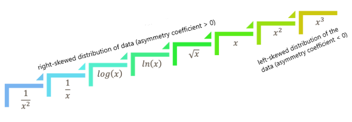

```{r setup, include=FALSE}
knitr::opts_chunk$set(warning = FALSE, message = FALSE, fig.align = "center", fig.keep = "all", echo=FALSE)

if (!require("randomForest", quietly = TRUE))
    install.packages("randomForest")
if (!require("caret", quietly = TRUE))
    install.packages("caret")
if (!require('pcaMethods', quietly = TRUE))
    install.packages('pcaMethods')
if (!require('DT', quietly = TRUE))
    install.packages('DT')
if (!require('ggpubr', quietly = TRUE))
    install.packages('ggpubr')
if (!require('ggplot2', quietly = TRUE))
    install.packages('ggplot2')
if (!require('dplyr', quietly = TRUE))
    install.packages('dplyr')
if (!require('tidyr', quietly = TRUE))
    install.packages('tidyr')
if (!require('vsn', quietly = TRUE))
    install.packages('vsn')

show_cv_table <- function(df) {
    DT::datatable(df, rownames = FALSE, 
              options=list(searching=FALSE, paging=FALSE, info=FALSE)) |>
    DT::formatStyle(columns = c('mean_KO', 'mean_WT', 'median_KO', 'median_WT'), 
                    background = DT::styleInterval(c(0, 25), c('white','lightgreen', 'white'))) |>
    DT::formatStyle(columns = 'method', fontWeight = 'bold')
}

assign_missing <- function(protein.ids, condition, lfq_intensity) {
    # verification of the fxn assumptions
    if (!is.factor(condition)) {rlang::abort('The condition are not factor!')}

    # occurences of protein IDs per condition
    occur <- dplyr::tibble(protein.ids) |>
        dplyr::group_by(protein.ids) |>
        dplyr::summarise(len = length(protein.ids)) |>
        dplyr::distinct(len)

    # occurences of condition
    occur_per_cond <- dplyr::tibble(protein.ids, condition) |>
        dplyr::group_by(protein.ids, condition) |>
        dplyr::summarise(len = length(protein.ids))
    occur_per_cond <- unique(occur_per_cond$len)

    if (length(protein.ids)/occur != length(unique(protein.ids))) {rlang::abort('The protein IDs are not unique!')}
    if (!is.numeric(lfq_intensity)) {rlang::abort('The lfq intensities are not numeric!')}

    df <- data.frame('prot.IDs'=protein.ids, 'condition'=condition, 'lfq'=lfq_intensity)

    # Calculating number of missing values for each protein
    number_missing <- df |>
        dplyr::group_by(prot.IDs) |>
        dplyr::summarise(no_NAs = sum(is.na(lfq)))

    missingness <- purrr::map(number_missing$no_NAs, function(no) {
            if (no == occur) {
              rep('all_NA', occur)
            } else if (no == occur-1) {
              rep('MNAR', occur)
            } else if (no < occur-1 & no != 0) {
              rep('MAR', occur)
            } else {
              rep('complete', occur)
            }
        })
    missingness <- data.frame(do.call(c,missingness))

    prot.id.miss <- purrr::map(unique(number_missing$prot.IDs), function(id) rep(id, occur))
    prot.id.miss <- data.frame(do.call(c,prot.id.miss))

    df_miss <- data.frame(prot.id.miss, missingness)
    colnames(df_miss) <- c('prot.IDs', 'missingness')


    missingness <- lapply(unique(protein.ids), function(id) df_miss[which(df_miss$prot.IDs == id),'missingness'])
    df$missingness <- do.call(c,missingness)

    ret_list <- list(df = df, missingness=df$missingness)
}

ttest <- function(df, grp1, grp2){ 
  x = df[grp1]
  y = df[grp2]
  x = as.numeric((x))
  y = as.numeric((y))
  results = t.test(x,y, 
                   alternative = 'two.sided', #one-sided: 'greater' is x > y
                   paired = T,
                   na.action=na.omit)
  results$p.value
}

p.cutoff = 0.05 #set p value cutoff
FC.cutoff = 1 # set fold change cutoff

plothist <- function(df, title='', plot.title.and.legend=TRUE) {
    if (!is.data.frame(df)) { df <- as.data.frame(df)}
    
    # Assuming LFQ_KO is our data frame with at least 3 columns
    # Reshape the data to a long format
    df <- df |>
        pivot_longer(cols = 1:ncol(df), names_to = "Rep", values_to = "LFQValue")
    
    # Plot all histograms on the same plot using ggplot
    if (plot.title.and.legend) {
        ret_plot <- ggplot(df, aes(x = LFQValue, fill = Rep)) +
            geom_histogram(alpha = 0.4, position = "identity", bins = 30) +
            labs(title = paste(title), x = "Values", y = "Frequency") +
            theme(legend.title = element_blank())
    } else {
        ret_plot <- ggplot(df, aes(x = LFQValue, fill = Rep)) +
            geom_histogram(alpha = 0.4, position = "identity", bins = 30) +
            labs(x = "Values", y = "Frequency") +
            theme(legend.title = element_blank(), legend.position = 'none')
    }
    return(ret_plot)
}

plotoneviolin <- function(object, title='') {
    object <- as.data.frame(object) |>
        pivot_longer(everything(), names_to = 'Sample', values_to = 'LFQ_CV')
    
    ggplot(data=object, aes(x=Sample, y=LFQ_CV, fill=Sample))+
        geom_boxplot(width=0.2)+
        geom_violin(alpha=0.4)+
        labs(title=title,x=NULL,y='LFQ CV[%]')+
        theme(legend.position = 'none',
              panel.background = element_rect(fill='white', colour = 'grey'),
              panel.grid = element_line(colour = 'grey'))
}

library(ggplot2)
library(ggpubr)
library(dplyr)
library(tidyr)
library(vsn)
library(protti)
source('EigenMS/EigenMS/EigenMS.R')

writeLines('table {
  width: 100%;
  border-collapse: collapse;
}
th, td {
  width: 14.28%; /* Distribute width equally (100% / 7 columns) */
  border: 1px #f2f2f2;
  text-align: center; /* Center the text */
  padding: 8px;
}
th {
  background-color: #f2f2f2;
  border: 0px;
}
body {
    text-align: justify
}', con = 'document_style.css')
```

# Introduction

The results below shows the comparison of several normalization and imputation methods.
We decided to use 4 imputation methods:

1. Shifted Distribution based on the data;
2. Imputation using the Random Forest algorithm;
3. Imputation using the k-Nearest Neighbors algorithm;
4. Imputation using the ludovic method.

and 8 normalization methods:

1. Z-Score Normalization
2. Min-Max Normalization
3. Median Scaling
4. MAD (Median Absolute Deviation) Scaling
5. Linear Regression Normalization
6. VSN (Variance Stabilization Normalization)
7. EigenMS

We selected the following features to train the machine learning models:

* **Sequence coverage** - percentage of the sequence that is covered by the identified
peptides of the first protein sequence contained in the group;
* **Sequence length** - the length of the leading protein sequence contained in the group;
* **Mol weigth kDa** - molecular weight of the leading protein sequence contained 
in the protein group;
* **Qvalue** - the ratio of reverse to forward protein groups;
* **Score** - Protein score which is derived from peptide posterior error probabilities
* **MS/MS Count** - the number of tandem MS scans that were made based on this full 
scan (e.g. a top 10 method selects the top 10 most intense ions in the scan and 
fragments those).
* LFQ values for TOTALS (KO 22/23/24 and WT 22/23/24) - target
* Based on the column names of tje LFQ values, we created 2 more features: 
    1. **celltype** - Knockout (KO) or Wild Type (WT) - for kNN encoded as (1:KO, 2:WT)
    2. **rep** - replicates (22, 23 or 24) - for kNN encoded as (1:22, 2:23, 3:24)

We used the following parameters for the K-Nearest Neighbors algorithm (bold row):

| k | RMSE | Rsquared | MAE |
|:--:|:--:|:--:|:--:|
| **5** | **560141411** | **0.5764903** | **83499878** |
| 7 | 586141572 | 0.5110148 | 89345187 |
| 9 | 615649021 | 0.4549313 | 93976048 |

For the Random Forest algorithm we used the Grid Search method to find the best hyperparameters.
The table belows shows the output of the top 10 models.

<center><b style='font-size:20px'>GRID SEARCH FOR RANDOM FOREST MODEL</b></center>
<br>

|     | num.trees | mtry | min.node.size | replace | sample.fraction |        rmse         | perc_gain |
|:---:|:---------:|:----:|:-------------:|:-------:|:---------------:|:-------------------:|:---------:|
|**1**|  **100**  | **4**|         **5** |**false**|         **0.8** |  **36184321.6466**  | **2.8631**|
|  2  |       500 |    4 |             5 | false   |            0.8  |    367032968.8757   |     1.4713|
|  3  |       300 |    4 |             5 | false   |            0.8  |    367963900.30284  |     1.2214|
|  4  |       500 |    4 |             1 | true    |            0.8  |    370084110.1524   |     0.6523|
|  5  |       500 |    4 |            10 | false   |            0.8  |    370380581.2619   |     0.5727|
|  6  |       300 |    4 |             1 | true    |           0.63  |    371446664.9562   |     0.2865|
|  7  |       100 |    4 |             5 | false   |            0.8  |    372131148.9947   |     0.1027|
|  8  |       300 |    4 |            10 | false   |            0.8  |    372169999.3198   |     0.0923|
|  9  |       300 |    4 |             4 | true    |           0.63  |    372767670.8139   |    -0.0681|
| 10  |       300 |    4 |             3 | true    |            0.8  |    373586116.5828   |    -0.2878|


Base on the output of the grid search, we can see that there is better model than default and 
it is random forest model with the following hyperparameters:

* num.trees = 100
* mtry = 4
* min.node.size = 5
* replace = FALSE
* sample.fraction = 0.80

We train Linear Regression Model which, after the stepwise selection, has the following formula:

$$LFQvalue = 8631815 \cdot no.proteins -18172773 \cdot peptides + 1794237 \cdot
seq.coverage +\\ + 807933 \cdot mol.weight.kDa + 430143 \cdot score + 1490175 \cdot ms.count$$

Where:

* `no.proteins` - Number of proteins contained within the group.
* `peptides` - The total number of peptide sequences associated with the protein 
group (i.e. for all the proteins in the group).
* `seq.coverage` - Percentage of the sequence that is covered by the identified
peptides of the first protein sequence contained in the group.
* `mol.wieght.kDa` - Molecular weight of the leading protein sequence contained 
in the protein group.
* `score` - Andromeda score for the best associated MS/MS spectrum.
* `ms.count` - The number of MS/MS spectra recorded in this raw file.

We train and compare 4 machine learning models and based on the performance (table 
below), we decided to use 2 of them:

1. Random Forest
2. kNN

|     Model     | NRMSE |  MSE  | RMSE  |  MAE  |   R2   |
|:-------------:|:-----:|:-----:|:-----:|:-----:|:------:|
| **RF**        | 0.5724 | 0.8044 | 0.8969 | 0.6663 | 0.7615 |
| **kNN**       | 0.6070 | 1.0182 | 1.0091 | 0.7590 | 0.6701 |
| **LM**        | 0.8737 | 3.8825 | 1.9704 | 1.6091 | 0.2623 |
| **PCA**       | 1      | 6.8863 | 2.6242 | 2.2380 | 0      |


For the Ludovic method first we had to assign the missing values using the
[`protti::assign_missingness()`](https://jpquast.github.io/protti/reference/assign_missingness.html) 
fxn, which added the **`comparison`** column containing the comparison name for the specific 
treatment/reference pair and the **`missingness`** column with 4 types of missingness:

* **`"complete"`**: No missing values for every replicate of this reference/treatment 
pair for the specific grouping variable.
* **`"MNAR"`**: Missing not at random. All replicates of either the reference or 
treatment condition have missing values for the specific grouping variable.
* **`"MAR"`**: Missing at random. At least n-1 replicates have missing values for the 
reference/treatment pair for the specific grouping variable.
* **`NA`**: The comparison is not complete enough to fall into any other category. 
It will not be imputed if imputation is performed.

Then with additional column we could enter our data into 
[`protti::impute()`](https://jpquast.github.io/protti/reference/impute.html) 
fxn, which performs the Ludovic imputation method based on the **`missingness`** column
using the following instructions:

* **`"MNAR"`** missingness is sampled from a normal distribution around a value that 
is three lower (log2) than the lowest intensity value recorded for the 
precursor/peptide and that has a spread of the mean standard deviation for the precursor/peptide.
* **`"MAR"`** data is imputed using the mean and variance of the condition with the missing data.
* **`NA`** data is not imputed.

```{r load data}
# load raw data
protein.groups <- readr::read_tsv('./data/proteinGroups.txt',show_col_types = FALSE)

protein.groups <- protein.groups |> filter(is.na(`Only identified by site`),
                         is.na(Reverse),
                         is.na(`Potential contaminant`))

# non-imputed data
lfq <- read.csv('./data/nonimputed_lfq.csv')

# imputed data with Mateusz fxn
lfq_imp <- read.csv('./data/LFQ_raw_totals_imp.csv')
colnames(lfq_imp) <- gsub('_TOTALS_', '.I.', colnames(lfq_imp))
```

```{r nonimp TOTALS data}
# Extracting only TOTALS data for knockout
LFQ_KO <- lfq |> select(contains('KO'))

# Extracting only TOTALS data for wild type
LFQ_WT <- lfq |> select(contains('WT'))
```

```{r imp TOTALS data}
# Extracting only TOTALS data for knockout
LFQ_KO_imp <- lfq_imp |> select(contains('KO'))

# Extracting only TOTALS data for wild type
LFQ_WT_imp <- lfq_imp |> select(contains('WT'))
```

```{r data to RF and kNN}
# extracting columns to machine learning models
df_ml <- protein.groups |>
    dplyr::select(`Number of proteins`, Peptides, `Sequence coverage [%]`, `Sequence length`, 
                  `Mol. weight [kDa]`, `Q-value`, Score, `MS/MS count`, 
                  dplyr::starts_with('LFQ Intensity') & (ends_with('22') | ends_with('23') | ends_with('24')) & dplyr::contains('TOTALS'))

# changing the colnames
colnames(df_ml)[9:14] <- gsub('LFQ intensity ', '', colnames(df_ml)[9:14])

# making longer data frame with one column containing all LFQ values
df_ml <- df_ml |>
    dplyr::mutate(prot.id = paste('prot',1:nrow(df_ml),sep='_')) |>
    tidyr::pivot_longer(9:14, names_to = 'Sample', values_to = 'LFQvalue') |>
    tidyr::separate(col=Sample, into=c("celltype","sampletype","rep"), sep = "_", remove = FALSE) |>
    dplyr::mutate(celltype = as.factor(celltype), sampletype = as.factor(sampletype),
                  rep = as.factor(rep))

# changing values with 0 to NA
df_ml$LFQvalue[df_ml$LFQvalue==0] <- NA

df_ml$missingness <- assign_missing(df_ml$prot.id, df_ml$celltype, df_ml$LFQvalue)$missingness

# removing blank spaces and all separators from colnames
colnames(df_ml)[1:8] <- c('no.proteins', 'peptides','seq.coverage','seq.len',
                                      'mol.weight.kDa','q.value','score','ms.count')

# Remove unnecessary columns and reordering columns
df_ml.to.models <- df_ml |>
    dplyr::select(-prot.id, -Sample, -sampletype) |> dplyr::select(1:10, 12, 11) |>
    dplyr::mutate(missingness = as.numeric(as.factor(missingness)),
                  celltype = as.numeric(celltype),
                  rep = as.numeric(rep))

df_ml <- df_ml |>
    dplyr::select(-prot.id, -Sample) |> dplyr::select(1:11, 13, 12) |>
    dplyr::mutate(missingness = as.factor(missingness))
```

```{r data to protti}
df_to_protti <- protein.groups |>
    dplyr::select(`Protein IDs`, `Peptide sequences`, 
           contains('LFQ intensity') & contains('TOTALS') & (ends_with('22') | ends_with('23') | ends_with('24'))) |>
    dplyr::mutate(`Protein IDs`= paste('prot_', 1:nrow(protein.groups), sep='')) |>
    tidyr::pivot_longer(3:8, names_to = 'Sample', values_to = 'Intensity')|>
    dplyr::mutate(Sample = gsub('LFQ intensity ', '', Sample)) |>
    dplyr::mutate(Sample = gsub('_TOTALS_', '_', Sample)) |>
    tidyr::separate(col =  Sample, into = c("celltype","rep"), sep = "_", remove = F) |>
    dplyr::mutate(Condition = ifelse(celltype == 'KO', 'treated', 'control'),
           Intensity = ifelse(Intensity == 0, NA, log2(Intensity))) |> 
    dplyr::select(Sample, `Protein IDs`, `Peptide sequences`, Condition, Intensity) 
```

```{r train/test split}
# creating data with no NA to train models
df_ml.no.na <- na.omit(df_ml.to.models)

# set seed to avoid different models and test/train data with each run
set.seed(123)
# split data to train and test
train_data_idx <- sample(1:nrow(df_ml.no.na), ceiling(0.7*nrow(df_ml.no.na)))
train_data <- df_ml.no.na[train_data_idx,]
```

```{r imputation RF}
# training random forest model
rf.model <- ranger::ranger(LFQvalue ~ .,
                          data=train_data,
                          num.trees = 100,
                          mtry = 4,
                          min.node.size = 5,
                          replace = FALSE,
                          sample.fraction = 0.8,
                          seed = 123,
                          importance = 'impurity')

# extracting missing rows - can be usefull later
missing <- which(is.na(df_ml$LFQvalue))

# predict the values for NA rows
predictions <- predict(rf.model, df_ml.to.models[missing,])

# data frame with predicted LFQ values by random forest model
imputed_RF <- df_ml
imputed_RF[missing,13] <- predictions$predictions
imputed_RF <- imputed_RF |>
    dplyr::select(celltype, rep, LFQvalue) |>
    dplyr::mutate('Batch' = paste(celltype, rep, sep='.'),
                  LFQvalue = log2(LFQvalue)) |>
    dplyr::select(Batch, LFQvalue) |>
    tidyr::pivot_wider(id_cols=everything(), names_from = Batch, values_from = LFQvalue, values_fn = list) |>
    unnest(cols = c(KO.22, KO.23, KO.24, WT.22, WT.23, WT.24))

# extracting KO and WT
LFQ_KO_RF <- imputed_RF |> dplyr::select(contains('KO'))
LFQ_WT_RF <- imputed_RF |> dplyr::select(contains('WT'))
```

```{r imputation kNN}
# calculating kNN model
kNN.model <- caret::train(LFQvalue ~ ., data=train_data, method='knn')

# predict the values for NA rows
predictions2 <- predict(kNN.model, df_ml.to.models[missing,1:12])

# data frame with predicted LFQ values by random forest model
imputed_kNN <- df_ml
imputed_kNN[missing,13] <- predictions2
imputed_kNN <- imputed_kNN |>
    dplyr::select(celltype, rep, LFQvalue) |>
    dplyr::mutate('Batch' = paste(celltype, rep, sep='.'),
                  LFQvalue = log2(LFQvalue)) |>
    dplyr::select(Batch, LFQvalue) |>
    tidyr::pivot_wider(id_cols=everything(), names_from = Batch, values_from = LFQvalue, values_fn = list) |>
    unnest(cols = c(KO.22, KO.23, KO.24, WT.22, WT.23, WT.24))

# extracting KO and WT
LFQ_KO_kNN <- imputed_kNN |> dplyr::select(contains('KO'))
LFQ_WT_kNN <- imputed_kNN |> dplyr::select(contains('WT'))
```

```{r ludovic imputation}
# assign missingness with protti fxn
data_missing <- df_to_protti |>
    assign_missingness(sample=Sample,
                       condition = Condition,
                       grouping = `Protein IDs`,
                       intensity = Intensity,
                       ref_condition = 'all')

# impute data with protti fxn using ludovic method
imputed_ludovic <- impute(
    data_missing,
    sample = Sample,
    grouping = `Protein IDs`,
    intensity_log2 = Intensity,
    condition = Condition,
    comparison = comparison,
    missingness = missingness,
    method = 'ludovic',
    skip_log2_transform_error = TRUE
)
rm(data_missing)

# remove the NA values 
imputed_ludovic <- imputed_ludovic[which(!is.na(imputed_ludovic$missingness)),]

# extracting KO and WT
imputed_ludovic <- imputed_ludovic |>
    dplyr::select(Sample, imputed_intensity, `Protein IDs`, missingness) |>
    tidyr::pivot_wider(id_cols = everything(), names_from = Sample, values_from = imputed_intensity)

LFQ_KO_ludovic <- imputed_ludovic |> dplyr::select(contains('KO'))
LFQ_WT_ludovic <- imputed_ludovic |> dplyr::select(contains('WT'))
```

# Distributions {.tabset}

**Summary**<br>
Below we can see the distribution of non-imputed data and data imputed with 4 methods:

1. Shifted Distribution based on the data;
2. Imputation using the Random Forest algorithm;
3. Imputation using the k-Nearest Neighbors algorithm;
4. Imputation using the ludovic method.

For each histogram, we can see that the 24th replicate (blue colour) of the KO 
cell type  has a distribution shift to the right. Our goal is to get this 
distribution closer to the others, and we can do this using different 
normalization methods.

## Mati Code

```{r distributions mati code}
ggarrange(
    plothist(LFQ_KO, '', FALSE) + xlab('KO') + ggtitle('Non-Imputed'), 
    plothist(LFQ_WT, '', FALSE) + xlab('WT') + ggtitle(''),
    plothist(LFQ_KO_imp, '', FALSE) + xlab('KO') + ggtitle('Imputed'), 
    plothist(LFQ_WT_imp, '', FALSE) + xlab('WT') + ggtitle(''),
    nrow=2,ncol=2
)
```

## Random Forest

```{r distribution rf}
ggarrange(
    plothist(LFQ_KO, '', FALSE) + xlab('KO') + ggtitle('Non-Imputed'), 
    plothist(LFQ_WT, '', FALSE) + xlab('WT') + ggtitle(''),
    plothist(LFQ_KO_RF, '', FALSE) + xlab('KO') + ggtitle('Imputed - Random Forest'), 
    plothist(LFQ_WT_RF, '', FALSE) + xlab('WT') + ggtitle(''),
    nrow=2,ncol=2
)
```

## k-Nearest Neighbors

```{r distribution kNN}
ggarrange(
    plothist(LFQ_KO, '', FALSE) + xlab('KO') + ggtitle('Non-Imputed'), 
    plothist(LFQ_WT, '', FALSE) + xlab('WT') + ggtitle(''),
    plothist(LFQ_KO_kNN, '', FALSE) + xlab('KO') + ggtitle('Imputed - kNN'), 
    plothist(LFQ_WT_kNN, '', FALSE) + xlab('WT') + ggtitle(''),
    nrow=2,ncol=2
)
```

## Ludovic

```{r distribution ludovic}
ggarrange(
    plothist(LFQ_KO, '', FALSE) + xlab('KO') + ggtitle('Non-Imputed'), 
    plothist(LFQ_WT, '', FALSE) + xlab('WT') + ggtitle(''),
    plothist(LFQ_KO_ludovic, '', FALSE) + xlab('KO') + ggtitle('Imputed - Ludovic'), 
    plothist(LFQ_WT_ludovic, '', FALSE) + xlab('WT') + ggtitle(''),
    nrow=2,ncol=2
)
```

# Transformations {.tabset}

The first methods which we should use to bring the 24th distribution closer to other 
replicates are transformations. The basic transformations are based on the skewness/asymmetry 
coefficient and the figure below shows which transformation we should use based on 
the value of the skewness.

<center>

</center>

Below we can find the results for our raw non-imputed data, imputed data, imputed with 
Random Forest, imputed with kNN and imputed with the Ludovic method. We calculated
the coefficient of skewness on unlogged data.

**Summary**<br>
As we can see below, none of the transformations solved the problem of the 24th 
replicate distribution (highlighted column) and therefore we have to use normalization methods.

## Raw Data

```{r skew raw}
skew <- data.frame(raw_data = moments::skewness(2^lfq,na.rm=T),
                   sqrt = moments::skewness(sqrt(2^lfq),na.rm=T),
                   log = moments::skewness(log(2^lfq),na.rm=T),
                   log10 = moments::skewness(log10(2^lfq),na.rm=T),
                   `frac` = moments::skewness(1/(2^lfq),na.rm=T))
DT::datatable(t(round(skew,4)), options=list(paging=F, info=F, searching=F)) |>
    DT::formatStyle(3, backgroundColor ='lightgreen')
```

## Imputed

```{r skew imp}
skew_imp <- data.frame(raw_data = moments::skewness(2^lfq_imp,na.rm=T),
                   sqrt = moments::skewness(sqrt(2^lfq_imp)),
                   log = moments::skewness(log(2^lfq_imp)),
                   log10 = moments::skewness(log10(2^lfq_imp)),
                   `frac` = moments::skewness(1/(2^lfq_imp)))
DT::datatable(t(round(skew_imp,4)), options=list(paging=F, info=F, searching=F)) |>
    DT::formatStyle(3, backgroundColor ='lightgreen')
```

## Random Forest

```{r skew rf}
skew_rf <- data.frame(raw_data = moments::skewness(2^imputed_RF,na.rm=T),
                   sqrt = moments::skewness(sqrt(2^imputed_RF)),
                   log = moments::skewness(log(2^imputed_RF)),
                   log10 = moments::skewness(log10(2^imputed_RF)),
                   `frac` = moments::skewness(1/(2^imputed_RF)))
DT::datatable(t(round(skew_rf,4)), options=list(paging=F, info=F, searching=F)) |>
    DT::formatStyle(3, backgroundColor ='lightgreen')
```

## k-Nearest Neighbors

```{r skew kNN}
skew_kNN <- data.frame(raw_data = moments::skewness(2^imputed_kNN,na.rm=T),
                   sqrt = moments::skewness(sqrt(2^imputed_kNN)),
                   log = moments::skewness(log(2^imputed_kNN)),
                   log10 = moments::skewness(log10(2^imputed_kNN)),
                   `frac` = moments::skewness(1/(2^imputed_kNN)))
DT::datatable(t(round(skew_kNN,4)), options=list(paging=F, info=F, searching=F)) |>
    DT::formatStyle(3, backgroundColor ='lightgreen')
```

## Ludovic

```{r skew ludovic}
skew_ludovic <- data.frame(raw_data = moments::skewness(2^imputed_ludovic[,3:8],na.rm=T),
                   sqrt = moments::skewness(sqrt(2^imputed_ludovic[,3:8])),
                   log = moments::skewness(log(2^imputed_ludovic[,3:8])),
                   log10 = moments::skewness(log10(2^imputed_ludovic[,3:8])),
                   `frac` = moments::skewness(1/(2^imputed_ludovic[,3:8])))
DT::datatable(t(round(skew_ludovic,4)), options=list(paging=F, info=F, searching=F)) |>
    DT::formatStyle(3, backgroundColor ='lightgreen')
```

# Normalization {.tabset}

The 24th replicate of the KO cell type has the distribution shifted to the right and 
should be more similar to the other replicates. Therefore we tried several
normalization methods to achieve this goal. We used the following methods:

1. Z-Score
2. Min-Max
3. Median Scaling
4. MAD (Median Absolute Deviation) Scaling
5. Linear Regression
6. VSN (Variance Stabilization Normalization)
7. EigenMS

## Z-Score

**Z-score** normalization standardizes data by subtracting the mean and dividing 
by the standard deviation. This technique transforms data into a distribution 
with a mean of 0 and a standard deviation of 1.

Formula: $\tilde{y}_{ij} = \frac{y_ij - \bar{y_j}}{\theta_j}$, where:

* $y_ij$ - value of the LFQ;
* $\bar{y_j}$ - mean of the LFQ values;
* $\theta_j$ - standard deviation of the LFQ values.

```{r KO standardization}
LFQ_KO.standard <- as.data.frame(scale(LFQ_KO)) # Non-Imputed
LFQ_KO_imp.standard <- as.data.frame(scale(LFQ_KO_imp)) # Imputed - Mati Code
LFQ_KO_RF.standard <- as.data.frame(scale(LFQ_KO_RF)) # Imputed RF
LFQ_KO_kNN.standard <- as.data.frame(scale(LFQ_KO_kNN)) # Imputed kNN
LFQ_KO_ludovic.standard <- as.data.frame(scale(LFQ_KO_ludovic)) # Imputed ludovic
```

```{r WT standardization}
LFQ_WT.standard <- as.data.frame(scale(LFQ_WT)) # Non-Imputed
LFQ_WT_imp.standard <- as.data.frame(scale(LFQ_WT_imp)) # Imputed - Mati Code
LFQ_WT_RF.standard <- as.data.frame(scale(LFQ_WT_RF)) # Imputed RF
LFQ_WT_kNN.standard <- as.data.frame(scale(LFQ_WT_kNN)) # Imputed kNN
LFQ_WT_ludovic.standard <- as.data.frame(scale(LFQ_WT_ludovic)) # Imputed ludovic
```

**Summary** <br>
The Z-SCORE method brought the distribution closer together, but we lost
the original scale of the data and the differences are harder to see after normalization.

<center><b style='font-size:20px'>DISTRIBUTIONS</b></center>

```{r dist standardization, fig.height=4}
annotate_figure(ggarrange(
    plothist(LFQ_KO.standard, NULL, TRUE) + xlab('KO'), 
    plothist(LFQ_WT.standard, NULL, TRUE) + xlab('WT'),
    nrow=1,ncol=2
    ), top = text_grob('Non-Imputed Data', size = 16)
)
```

```{r}
ggarrange(
    annotate_figure(ggarrange(
        plothist(LFQ_KO_imp.standard, '', FALSE) + xlab('KO'), 
        plothist(LFQ_WT_imp.standard, '', FALSE) + xlab('WT'),
        nrow=1,ncol=2
        ), top = text_grob('Imputed Data - Mati Code', size = 16)
    ),
    annotate_figure(ggarrange(
        plothist(LFQ_KO_RF.standard, '', FALSE) + xlab('KO'), 
        plothist(LFQ_WT_RF.standard, '', FALSE) + xlab('WT'),
        nrow=1,ncol=2
        ), top = text_grob('Imputed Data - Random Forest', size = 16)
    ),
    nrow=2,ncol=1
)
ggarrange(
    annotate_figure(ggarrange(
        plothist(LFQ_KO_kNN.standard, '', FALSE) + xlab('KO'), 
        plothist(LFQ_WT_kNN.standard, '', FALSE) + xlab('WT'),
        nrow=1,ncol=2
        ), top = text_grob('Imputed Data - kNN', size = 16)
    ),
    annotate_figure(ggarrange(
        plothist(LFQ_KO_ludovic.standard, '', FALSE) + xlab('KO'), 
        plothist(LFQ_WT_ludovic.standard, '', FALSE) + xlab('WT'),
        nrow=1,ncol=2
        ), top = text_grob('Imputed Data - Ludovic', size = 16)
    ),
    nrow=2,ncol=1
)
```

## Min-Max

**Min-max** normalization scales data to a specified range (usually [0, 1]) by 
subtracting the minimum value and dividing by the range of values.

```{r minmax}
min_max_norm <- function(df) {
    df_no_na <- na.omit(df)
    ret <- scale(df_no_na, center = min(df_no_na), scale = max(df_no_na) - min(df_no_na))
    df[which(!is.na(df))] <- ret
    return(df)
}

LFQ_KO.minmax <- as.data.frame(lapply(LFQ_KO, function(col) min_max_norm(col)))  # Non-Imputed
LFQ_KO_imp.minmax <- as.data.frame(lapply(LFQ_KO_imp, function(col) min_max_norm(col)))  # Imputed
LFQ_KO_RF.minmax <- as.data.frame(lapply(LFQ_KO_RF, function(col) min_max_norm(col)))  # Imputed RF
LFQ_KO_kNN.minmax <- as.data.frame(lapply(LFQ_KO_kNN, function(col) min_max_norm(col)))  # Imputed kNN
LFQ_KO_ludovic.minmax <- as.data.frame(lapply(LFQ_KO_ludovic, function(col) min_max_norm(col)))  # Imputed ludovic

LFQ_WT.minmax <- as.data.frame(lapply(LFQ_WT, function(col) min_max_norm(col)))  # Non-Imputed
LFQ_WT_imp.minmax <- as.data.frame(lapply(LFQ_WT_imp, function(col) min_max_norm(col)))  # Imputed
LFQ_WT_RF.minmax <- as.data.frame(lapply(LFQ_WT_RF, function(col) min_max_norm(col)))  # Imputed RF
LFQ_WT_kNN.minmax <- as.data.frame(lapply(LFQ_WT_kNN, function(col) min_max_norm(col)))  # Imputed kNN
LFQ_WT_ludovic.minmax <- as.data.frame(lapply(LFQ_WT_ludovic, function(col) min_max_norm(col)))  # Imputed ludovic
```

**Summary** <br>
The MIN-MAX method didn't succeed in bringing the distribution closer together. 
In conclusion, we probably shouldn't use this method.

<center><b style='font-size:20px'>DISTRIBUTIONS</b></center>

```{r dist minmax, fig.height=4}
annotate_figure(ggarrange(
    plothist(LFQ_KO.minmax, NULL, TRUE) + xlab('KO'), 
    plothist(LFQ_WT.minmax, NULL, TRUE) + xlab('WT'),
    nrow=1,ncol=2
    ), top = text_grob('Non-Imputed Data', size = 16)
)
```

```{r}
ggarrange(
    annotate_figure(ggarrange(
        plothist(LFQ_KO_imp.minmax, '', FALSE) + xlab('KO'), 
        plothist(LFQ_WT_imp.minmax, '', FALSE) + xlab('WT'),
        nrow=1,ncol=2
        ), top = text_grob('Imputed Data - Mati Code', size = 16)
    ),
    annotate_figure(ggarrange(
        plothist(LFQ_KO_RF.minmax, '', FALSE) + xlab('KO'), 
        plothist(LFQ_WT_RF.minmax, '', FALSE) + xlab('WT'),
        nrow=1,ncol=2
        ), top = text_grob('Imputed Data - Random Forest', size = 16)
    ),
    nrow=2,ncol=1
)

ggarrange(
    annotate_figure(ggarrange(
        plothist(LFQ_KO_kNN.minmax, '', FALSE) + xlab('KO'), 
        plothist(LFQ_WT_kNN.minmax, '', FALSE) + xlab('WT'),
        nrow=1,ncol=2
        ), top = text_grob('Imputed Data - kNN', size = 16)
    ),
    annotate_figure(ggarrange(
        plothist(LFQ_KO_ludovic.minmax, '', FALSE) + xlab('KO'), 
        plothist(LFQ_WT_ludovic.minmax, '', FALSE) + xlab('WT'),
        nrow=1,ncol=2
        ), top = text_grob('Imputed Data - Ludovic', size = 16)
    ),
    nrow=2,ncol=1
)
```

## Median Scaling

**Median Scaling**, also called the Robust Scalar, transforms x to x’ by subtracting each 
value of features by the median and dividing it by the interquartile range between 
the 1st quartile (25th quantile) and the 3rd quartile (75th quantile). The formula:

$$x' = \frac{x-median(x)}{(Q3-Q1)}$$

```{r median scaling}
LFQ_KO.med <- as.data.frame(DescTools::RobScale(LFQ_KO, scale=FALSE)) # Non-Imputed
LFQ_KO_imp.med <- as.data.frame(DescTools::RobScale(LFQ_KO_imp, scale=FALSE)) # Imputed
LFQ_KO_RF.med <- as.data.frame(DescTools::RobScale(LFQ_KO_RF, scale=FALSE)) # Imputed
LFQ_KO_kNN.med <- as.data.frame(DescTools::RobScale(LFQ_KO_kNN, scale=FALSE)) # Imputed
LFQ_KO_ludovic.med <- as.data.frame(DescTools::RobScale(LFQ_KO_ludovic, scale=FALSE)) # Imputed

LFQ_WT.med <- as.data.frame(DescTools::RobScale(LFQ_WT, scale=FALSE)) # Non-Imputed
LFQ_WT_imp.med <- as.data.frame(DescTools::RobScale(LFQ_WT_imp, scale=FALSE)) # Imputed
LFQ_WT_RF.med <- as.data.frame(DescTools::RobScale(LFQ_WT_RF, scale=FALSE)) # Imputed
LFQ_WT_kNN.med <- as.data.frame(DescTools::RobScale(LFQ_WT_kNN, scale=FALSE)) # Imputed
LFQ_WT_ludovic.med <- as.data.frame(DescTools::RobScale(LFQ_WT_ludovic, scale=FALSE)) # Imputed
```

**Summary**<br>
The MEDIAN scaling method brought the distributions closer together, but again we lost
the original scale of the data and the differences are harder to see after normalization.

<center><b style='font-size:20px'>DISTRIBUTIONS</b></center>

```{r dist median, fig.height=4}
annotate_figure(ggarrange(
    plothist(LFQ_KO.med, NULL, TRUE) + xlab('KO'), 
    plothist(LFQ_WT.med, NULL, TRUE) + xlab('WT'),
    nrow=1,ncol=2
    ), top = text_grob('Non-Imputed Data', size = 16)
)
```

```{r}
ggarrange(
    annotate_figure(ggarrange(
        plothist(LFQ_KO_imp.med, '', FALSE) + xlab('KO'), 
        plothist(LFQ_WT_imp.med, '', FALSE) + xlab('WT'),
        nrow=1,ncol=2
        ), top = text_grob('Imputed Data - Mati Code', size = 16)
    ),
    annotate_figure(ggarrange(
        plothist(LFQ_KO_RF.med, '', FALSE) + xlab('KO'), 
        plothist(LFQ_WT_RF.med, '', FALSE) + xlab('WT'),
        nrow=1,ncol=2
        ), top = text_grob('Imputed Data - Random Forest', size = 16)
    ),
    nrow=2,ncol=1
)

ggarrange(
    annotate_figure(ggarrange(
        plothist(LFQ_KO_kNN.med, '', FALSE) + xlab('KO'), 
        plothist(LFQ_WT_kNN.med, '', FALSE) + xlab('WT'),
        nrow=1,ncol=2
        ), top = text_grob('Imputed Data - kNN', size = 16)
    ),
    annotate_figure(ggarrange(
        plothist(LFQ_KO_ludovic.med, '', FALSE) + xlab('KO'), 
        plothist(LFQ_WT_ludovic.med, '', FALSE) + xlab('WT'),
        nrow=1,ncol=2
        ), top = text_grob('Imputed Data - Ludovic', size = 16)
    ),
    nrow=2,ncol=1
)
```

## MAD Scaling

**MAD** (**M**edian **A**bsoulte **D**eviation) **Scaling** transforms $x$ to $x'$ in 
similar way like Median Scaling, but it substractingthe MAD value from the $x$. 
The formula of MAD:

$$\tilde{X} = median(X) \\ MAD = median\Big(|X_i - \tilde{X}|\Big)$$

and the formula of scaling is:

$$x' = \frac{x - MAD}{(Q3-Q1)}$$

```{r mad scaling}
LFQ_KO.mad <- as.data.frame(DescTools::RobScale(LFQ_KO)) # Non-Imputed
LFQ_KO_imp.mad <- as.data.frame(DescTools::RobScale(LFQ_KO_imp)) # Imputed
LFQ_KO_RF.mad <- as.data.frame(DescTools::RobScale(LFQ_KO_RF)) # Imputed RF
LFQ_KO_kNN.mad <- as.data.frame(DescTools::RobScale(LFQ_KO_kNN)) # Imputed kNN
LFQ_KO_ludovic.mad <- as.data.frame(DescTools::RobScale(LFQ_KO_ludovic)) # Imputed ludovic

LFQ_WT.mad <- as.data.frame(DescTools::RobScale(LFQ_WT)) # Non-Imputed
LFQ_WT_imp.mad <- as.data.frame(DescTools::RobScale(LFQ_WT_imp)) # Imputed
LFQ_WT_RF.mad <- as.data.frame(DescTools::RobScale(LFQ_WT_RF)) # Imputed RF
LFQ_WT_kNN.mad <- as.data.frame(DescTools::RobScale(LFQ_WT_kNN)) # Imputed kNN
LFQ_WT_ludovic.mad <- as.data.frame(DescTools::RobScale(LFQ_WT_ludovic)) # Imputed ludovic
```

**Summary**<br>
The MAD scaling method brought the distributions closer together, but again we lost
the original scale of the data and the differences are harder to see after normalization.

<center><b style='font-size:20px'>DISTRIBUTIONS</b></center>

```{r dist mad, fig.height=4}
annotate_figure(ggarrange(
    plothist(LFQ_KO.mad, NULL, TRUE) + xlab('KO'), 
    plothist(LFQ_WT.mad, NULL, TRUE) + xlab('WT'),
    nrow=1,ncol=2
    ), top = text_grob('Non-Imputed Data', size = 16)
)
```

```{r}
ggarrange(
    annotate_figure(ggarrange(
        plothist(LFQ_KO_imp.mad, '', FALSE) + xlab('KO'), 
        plothist(LFQ_WT_imp.mad, '', FALSE) + xlab('WT'),
        nrow=1,ncol=2
        ), top = text_grob('Imputed Data - Mati Code', size = 16)
    ),
    annotate_figure(ggarrange(
        plothist(LFQ_KO_RF.mad, '', FALSE) + xlab('KO'), 
        plothist(LFQ_WT_RF.mad, '', FALSE) + xlab('WT'),
        nrow=1,ncol=2
        ), top = text_grob('Imputed Data - Random Forest', size = 16)
    ),
    nrow=2,ncol=1
)

ggarrange(
    annotate_figure(ggarrange(
        plothist(LFQ_KO_kNN.mad, '', FALSE) + xlab('KO'), 
        plothist(LFQ_WT_kNN.mad, '', FALSE) + xlab('WT'),
        nrow=1,ncol=2
        ), top = text_grob('Imputed Data - kNN', size = 16)
    ),
    annotate_figure(ggarrange(
        plothist(LFQ_KO_ludovic.mad, '', FALSE) + xlab('KO'), 
        plothist(LFQ_WT_ludovic.mad, '', FALSE) + xlab('WT'),
        nrow=1,ncol=2
        ), top = text_grob('Imputed Data - Ludovic', size = 16)
    ),
    nrow=2,ncol=1
)
```

## Linear Regression

Normalization by linear regression using a residual of the linear model $y = ax + b$
to normalize the data. In our project we have two variables: independent and dependent.
The independent variable is **Batch** and the dependent variable is **LFQ**.

```{r KO lm}
# Non-Imputed
LFQ_KO_long <- LFQ_KO |>
    pivot_longer(cols = 1:3, names_to = "Batch", values_to = "LFQValue")

model <- lm(LFQValue ~ Batch, data=LFQ_KO_long) # calculate linear model
LFQ_KO_long$normalized <- NA # preparing column for normalized data
LFQ_KO_long[which(!is.na(LFQ_KO_long$LFQValue)), 'normalized'] <- residuals(model)

# reshape data to the wide format
LFQ_KO.lm <- LFQ_KO_long |> 
    mutate(row = rep(1:nrow(LFQ_KO), each=3)) |>
    reshape2::dcast(row ~ Batch, value.var='normalized') |>
    select(-row)

# Imputed Mati Code
LFQ_KO_long <- LFQ_KO_imp |>
    pivot_longer(cols = 1:3, names_to = "Batch", values_to = "LFQValue")

model <- lm(LFQValue ~ Batch, data=LFQ_KO_long) # calculate linear model
LFQ_KO_long$normalized <- residuals(model) # normalized data

# reshape data to the wide format
LFQ_KO_imp.lm <- LFQ_KO_long |> 
    mutate(row = rep(1:nrow(LFQ_KO_imp), each=3)) |>
    reshape2::dcast(row ~ Batch, value.var='normalized') |>
    select(-row)

# Imputed RF
LFQ_KO_long <- LFQ_KO_RF |>
    pivot_longer(cols = 1:3, names_to = "Batch", values_to = "LFQValue")

model <- lm(LFQValue ~ Batch, data=LFQ_KO_long) # calculate linear model
LFQ_KO_long$normalized <- residuals(model) # normalized data

# reshape data to the wide format
LFQ_KO_RF.lm <- LFQ_KO_long |> 
    mutate(row = rep(1:nrow(LFQ_KO_RF), each=3)) |>
    reshape2::dcast(row ~ Batch, value.var='normalized') |>
    select(-row)

# Imputed kNN
LFQ_KO_long <- LFQ_KO_kNN |>
    pivot_longer(cols = 1:3, names_to = "Batch", values_to = "LFQValue")

model <- lm(LFQValue ~ Batch, data=LFQ_KO_long) # calculate linear model
LFQ_KO_long$normalized <- residuals(model) # normalized data

# reshape data to the wide format
LFQ_KO_kNN.lm <- LFQ_KO_long |> 
    mutate(row = rep(1:nrow(LFQ_KO_kNN), each=3)) |>
    reshape2::dcast(row ~ Batch, value.var='normalized') |>
    select(-row)

# Imputed ludovic
LFQ_KO_long <- LFQ_KO_ludovic |>
    pivot_longer(cols = 1:3, names_to = "Batch", values_to = "LFQValue")

model <- lm(LFQValue ~ Batch, data=LFQ_KO_long) # calculate linear model
LFQ_KO_long$normalized <- residuals(model) # normalized data

# reshape data to the wide format
LFQ_KO_ludovic.lm <- LFQ_KO_long |> 
    mutate(row = rep(1:nrow(LFQ_KO_ludovic), each=3)) |>
    reshape2::dcast(row ~ Batch, value.var='normalized') |>
    select(-row)
```

```{r WT lm}
# Non-Imputed
LFQ_WT_long <- LFQ_WT |>
    pivot_longer(cols = 1:3, names_to = "Batch", values_to = "LFQValue")

model <- lm(LFQValue ~ Batch, data=LFQ_WT_long) # calculate linear model
LFQ_WT_long$normalized <- NA # preparing column for normalized data
# normalized data
LFQ_WT_long[which(!is.na(LFQ_WT_long$LFQValue)), 'normalized'] <- residuals(model)

# reshape data to the wide format
LFQ_WT.lm <- LFQ_WT_long |> 
    mutate(row = rep(1:nrow(LFQ_WT), each=3)) |>
    reshape2::dcast(row ~ Batch, value.var='normalized') |>
    select(-row)

# Imputed Mati Code
LFQ_WT_long <- LFQ_WT_imp |>
    pivot_longer(cols = 1:3, names_to = "Batch", values_to = "LFQValue")

model <- lm(LFQValue ~ Batch, data=LFQ_WT_long) # calculate linear model
LFQ_WT_long$normalized <- residuals(model) # normalized data

# reshape data to the wide format
LFQ_WT_imp.lm <- LFQ_WT_long |> 
    mutate(row = rep(1:nrow(LFQ_WT_imp), each=3)) |>
    reshape2::dcast(row ~ Batch, value.var='normalized') |>
    select(-row)

# Imputed RF
LFQ_WT_long <- LFQ_WT_RF |>
    pivot_longer(cols = 1:3, names_to = "Batch", values_to = "LFQValue")

model <- lm(LFQValue ~ Batch, data=LFQ_WT_long) # calculate linear model
LFQ_WT_long$normalized <- residuals(model) # normalized data

# reshape data to the wide format
LFQ_WT_RF.lm <- LFQ_WT_long |> 
    mutate(row = rep(1:nrow(LFQ_WT_RF), each=3)) |>
    reshape2::dcast(row ~ Batch, value.var='normalized') |>
    select(-row)

# Imputed kNN
LFQ_WT_long <- LFQ_WT_kNN |>
    pivot_longer(cols = 1:3, names_to = "Batch", values_to = "LFQValue")

model <- lm(LFQValue ~ Batch, data=LFQ_WT_long) # calculate linear model
LFQ_WT_long$normalized <- residuals(model) # normalized data

# reshape data to the wide format
LFQ_WT_kNN.lm <- LFQ_WT_long |> 
    mutate(row = rep(1:nrow(LFQ_WT_kNN), each=3)) |>
    reshape2::dcast(row ~ Batch, value.var='normalized') |>
    select(-row)

# Imputed ludovic
LFQ_WT_long <- LFQ_WT_ludovic |>
    pivot_longer(cols = 1:3, names_to = "Batch", values_to = "LFQValue")

model <- lm(LFQValue ~ Batch, data=LFQ_WT_long) # calculate linear model
LFQ_WT_long$normalized <- residuals(model) # normalized data

# reshape data to the wide format
LFQ_WT_ludovic.lm <- LFQ_WT_long |> 
    mutate(row = rep(1:nrow(LFQ_WT_ludovic), each=3)) |>
    reshape2::dcast(row ~ Batch, value.var='normalized') |>
    select(-row)
```

**Summary**<br>
The linear regression method brought the distributions closer together, but again we lost
the original scale of the data and the differences are harder to see after normalization.

<center><b style='font-size:20px'>DISTRIBUTIONS</b></center>

```{r dist lm, fig.height=4}
annotate_figure(ggarrange(
    plothist(LFQ_KO.lm, NULL, TRUE) + xlab('KO'), 
    plothist(LFQ_WT.lm, NULL, TRUE) + xlab('WT'),
    nrow=1,ncol=2
    ), top = text_grob('Non-Imputed Data', size = 16)
)
```

```{r}
ggarrange(
    annotate_figure(ggarrange(
        plothist(LFQ_KO_imp.lm, '', FALSE) + xlab('KO'), 
        plothist(LFQ_WT_imp.lm, '', FALSE) + xlab('WT'),
        nrow=1,ncol=2
        ), top = text_grob('Imputed Data - Mati Code', size = 16)
    ),
    annotate_figure(ggarrange(
        plothist(LFQ_KO_RF.lm, '', FALSE) + xlab('KO'), 
        plothist(LFQ_WT_RF.lm, '', FALSE) + xlab('WT'),
        nrow=1,ncol=2
        ), top = text_grob('Imputed Data - Random Forest', size = 16)
    ),
    nrow=2,ncol=1
)

ggarrange(
    annotate_figure(ggarrange(
        plothist(LFQ_KO_kNN.lm, '', FALSE) + xlab('KO'), 
        plothist(LFQ_WT_kNN.lm, '', FALSE) + xlab('WT'),
        nrow=1,ncol=2
        ), top = text_grob('Imputed Data - kNN', size = 16)
    ),
    annotate_figure(ggarrange(
        plothist(LFQ_KO_ludovic.lm, '', FALSE) + xlab('KO'), 
        plothist(LFQ_WT_ludovic.lm, '', FALSE) + xlab('WT'),
        nrow=1,ncol=2
        ), top = text_grob('Imputed Data - Ludovic', size = 16)
    ),
    nrow=2,ncol=1
)
```

## VSN

**VSN** - **V**ariance **S**tabilization **N**ormalization

The data are returned on a $glog$ scale to base 2. More precisely, the transformed 
data are subject to the transformation $glog_2(f(b)*x+a)+c$, where the function
$glog_2(u)=log_2(u+\sqrt{u*u+1}) = asinh(u)/log(2)$ is called the generalised logarithm, 
the offset $a$ and the scaling parameter $b$ are the fitted model parameters (see references), 
and $f(x)=exp(x)$ is a&nbsp;parameter transformation that allows ensuring positivity of 
the factor in front of x while using an unconstrained optimization over $b$&nbsp;[[source](https://www.bioconductor.org/packages/devel/bioc/vignettes/vsn/inst/doc/C-likelihoodcomputations.pdf)]. 
The overall offset $c$ is computed from the $b$'s such that for large $x$ the 
transformation approximately corresponds to the $log_2$ function. This is done 
separately for each stratum, but with the same value across arrays. More precisely, 
if the element $b[s,i]$ of the array $b$ is the scaling parameter for the $s$-th stratum
and the $i$-th array, then $c[s]$ is computed as $log2(2*f(mean(b[,i])))$. The&nbsp;offset
$c$ is  inconsequential for all differential expression calculations, but 
many users like to see the data in a range that they are familiar with.

```{r vsn}
# Preparing input into VSN fxn
lfq_rglist<- new('RGList', list(
    R = as.matrix(2^LFQ_KO),   # condition
    G = as.matrix(2^LFQ_WT)))  # control

# Preparing input into VSN fxn
lfq_rglist_imp<- new('RGList', list(
    R = as.matrix(2^LFQ_KO_imp),   # condition
    G = as.matrix(2^LFQ_WT_imp)))  # control

# Preparing input into VSN fxn
lfq_rglist_RF<- new('RGList', list(
    R = as.matrix(2^LFQ_KO_RF),   # condition
    G = as.matrix(2^LFQ_WT_RF)))  # control

# Preparing input into VSN fxn
lfq_rglist_kNN<- new('RGList', list(
    R = as.matrix(2^LFQ_KO_kNN),   # condition
    G = as.matrix(2^LFQ_WT_kNN)))  # control

# Preparing input into VSN fxn
lfq_rglist_ludovic <- new('RGList', list(
    R = as.matrix(2^LFQ_KO_ludovic),   # condition
    G = as.matrix(2^LFQ_WT_ludovic)))  # control

LFQ_KO.vsn <- justvsn(lfq_rglist)@assayData$R  # Non-Imputed
LFQ_KO_imp.vsn <- justvsn(lfq_rglist_imp)@assayData$R # Imputed
LFQ_KO_RF.vsn <- justvsn(lfq_rglist_RF)@assayData$R # Imputed RF
LFQ_KO_kNN.vsn <- justvsn(lfq_rglist_kNN)@assayData$R # Imputed kNN
LFQ_KO_ludovic.vsn <- justvsn(lfq_rglist_ludovic)@assayData$R # Imputed ludovic

LFQ_WT.vsn <- justvsn(lfq_rglist)@assayData$G  # Non-Imputed
LFQ_WT_imp.vsn <- justvsn(lfq_rglist_imp)@assayData$G # Imputed
LFQ_WT_RF.vsn <- justvsn(lfq_rglist_RF)@assayData$G # Imputed RF
LFQ_WT_kNN.vsn <- justvsn(lfq_rglist_kNN)@assayData$G # Imputed kNN
LFQ_WT_ludovic.vsn <- justvsn(lfq_rglist_ludovic)@assayData$G # Imputed ludovic
```

**Summary**<br>
The VSN method brought the distributions closer together and we didn't lose the 
original scale of the data. The method didn't lose the differences between 
KO and WT cells at first glance. In addition, the 24th replicate of KO cell doesn't
stand out only in distribution of imputed data with kNN.

<center><b style='font-size:20px'>DISTRIBUTIONS</b></center>

```{r dist vsn, fig.height=4}
annotate_figure(ggarrange(
    plothist(LFQ_KO.vsn, NULL, TRUE) + xlab('KO'), 
    plothist(LFQ_WT.vsn, NULL, TRUE) + xlab('WT'),
    nrow=1,ncol=2
    ), top = text_grob('Non-Imputed Data', size = 16)
)
```

```{r}
ggarrange(
    annotate_figure(ggarrange(
        plothist(LFQ_KO_imp.vsn, '', FALSE) + xlab('KO'), 
        plothist(LFQ_WT_imp.vsn, '', FALSE) + xlab('WT'),
        nrow=1,ncol=2
        ), top = text_grob('Imputed Data - Mati Code', size = 16)
    ),
    annotate_figure(ggarrange(
        plothist(LFQ_KO_RF.vsn, '', FALSE) + xlab('KO'), 
        plothist(LFQ_WT_RF.vsn, '', FALSE) + xlab('WT'),
        nrow=1,ncol=2
        ), top = text_grob('Imputed Data - Random Forest', size = 16)
    ),
    nrow=2,ncol=1
)

ggarrange(
    annotate_figure(ggarrange(
        plothist(LFQ_KO_kNN.vsn, '', FALSE) + xlab('KO'), 
        plothist(LFQ_WT_kNN.vsn, '', FALSE) + xlab('WT'),
        nrow=1,ncol=2
        ), top = text_grob('Imputed Data - kNN', size = 16)
    ),
    annotate_figure(ggarrange(
        plothist(LFQ_KO_ludovic.vsn, '', FALSE) + xlab('KO'), 
        plothist(LFQ_WT_ludovic.vsn, '', FALSE) + xlab('WT'),
        nrow=1,ncol=2
        ), top = text_grob('Imputed Data - Ludovic', size = 16)
    ),
    nrow=2,ncol=1
)
```

## EigenMS

**EigenMS** is a normalization method developed for high-throughput mass spectrometry 
(MS) proteomics data. It uses eigenvector-based adjustments to remove unwanted 
variation, such as batch effects, from the data. The method works by identifying 
systematic biases in the dataset and applying a correction while preserving 
biologically relevant signals.

In the EigenMS method, eigentrends are calculated by decomposing the systematic 
variation in the proteomics data matrix using Singular Value Decomposition (SVD). 
This is typically expressed as:

$$X = U \Sigma V'$$
Where:

* $X$ represents the original data matrix.
* $U$ and $v'$ are orthogonal matrices.
* $\Sigma$ is a diagonal matrix of singular values.

The decomposition isolates systematic trends (eigentrends) as columns in $U$, 
which can then be removed to adjust for unwanted variation.

```{r EigenMS, fig.keep='none', results='hide'}
# a vector of treatments in the order corresponding to the columns in the data frame
treatment = as.factor(c('KO', 'KO', 'KO', 'WT', 'WT', 'WT'))

# Non-Imputed
prot.info <- data.frame(prot_ID = paste('prot_', 1:nrow(lfq), sep = '')) # add info about LFQ value
LFQ.eig1 <- eig_norm1(lfq, 
                      treatment = treatment, 
                      prot.info = prot.info)
# Performing eig normalization
LFQ.eig_norm <- eig_norm2(LFQ.eig1)

# Imputed
prot.info <- data.frame(prot_ID = paste('prot_', 1:nrow(lfq_imp), sep = '')) # add info about LFQ value
LFQ_imp.eig1 <- eig_norm1(lfq_imp, 
                          treatment = treatment, 
                          prot.info = prot.info)
# Performing eig normalization
LFQ_imp.eig_norm <- eig_norm2(LFQ_imp.eig1)

# Imputed RF
prot.info <- data.frame(prot_ID = paste('prot_', 1:nrow(imputed_RF), sep = '')) # add info about LFQ value
LFQ_RF.eig1 <- eig_norm1(imputed_RF, 
                         treatment = treatment, 
                         prot.info = prot.info)
# Performing eig normalization
LFQ_RF.eig_norm <- eig_norm2(LFQ_RF.eig1)

# Imputed kNN
prot.info <- data.frame(prot_ID = paste('prot_', 1:nrow(imputed_kNN), sep = '')) # add info about LFQ value
LFQ_kNN.eig1 <- eig_norm1(imputed_kNN, 
                          treatment = treatment, 
                          prot.info = prot.info)
# Performing eig normalization
LFQ_kNN.eig_norm <- eig_norm2(LFQ_kNN.eig1)

# Imputed ludovic
prot.info <- data.frame(imputed_ludovic$`Protein IDs`) # add info about LFQ value
LFQ_ludovic.eig1 <- eig_norm1(imputed_ludovic[,-c(1,2)],
                              treatment = treatment,
                              prot.info = prot.info)
# Performing eig normalization
LFQ_ludovic.eig_norm <- eig_norm2(LFQ_ludovic.eig1)
```

```{r KO and WT eigen}
LFQ_KO.eigen <- LFQ.eig_norm$norm_m[,1:3] # Non-Imputed
LFQ_KO_imp.eigen <- LFQ_imp.eig_norm$norm_m[,1:3] # Imputed Mati Code
LFQ_KO_RF.eigen <- LFQ_RF.eig_norm$norm_m[,1:3] # Imputed RF
LFQ_KO_kNN.eigen <- LFQ_kNN.eig_norm$norm_m[,1:3] # Imputed kNN
LFQ_KO_ludovic.eigen <- LFQ_ludovic.eig_norm$norm_m[,1:3] # Imputed ludovic

LFQ_WT.eigen <- LFQ.eig_norm$norm_m[,4:6] # Non-Imputed
LFQ_WT_imp.eigen <- LFQ_imp.eig_norm$norm_m[,4:6] # Imputed Mati Code
LFQ_WT_RF.eigen <- LFQ_RF.eig_norm$norm_m[,4:6] # Imputed RF
LFQ_WT_kNN.eigen <- LFQ_kNN.eig_norm$norm_m[,4:6] # Imputed kNN
LFQ_WT_ludovic.eigen <- LFQ_ludovic.eig_norm$norm_m[,4:6] # Imputed ludovic
```

**Summary**<br>
The EigenMS method was the one which kept the differences between the replicates 
and cell types (KO and WT). The distribution are close together and we solve the 
problem of 24th replicate. In my opinion the EigenMS method gives the best results.

<center><b style='font-size:20px'>DISTRIBUTIONS</b></center>

```{r dist eigen, fig.height=4}
annotate_figure(ggarrange(
    plothist(LFQ_KO.eigen, NULL, TRUE) + xlab('KO'), 
    plothist(LFQ_WT.eigen, NULL, TRUE) + xlab('WT'),
    nrow=1,ncol=2
    ), top = text_grob('Non-Imputed Data', size = 16)
)
```

```{r}
ggarrange(
    annotate_figure(ggarrange(
        plothist(LFQ_KO_imp.eigen, '', FALSE) + xlab('KO'), 
        plothist(LFQ_WT_imp.eigen, '', FALSE) + xlab('WT'),
        nrow=1,ncol=2
        ), top = text_grob('Imputed Data - Mati Code', size = 16)
    ),
    annotate_figure(ggarrange(
        plothist(LFQ_KO_RF.eigen, '', FALSE) + xlab('KO'), 
        plothist(LFQ_WT_RF.eigen, '', FALSE) + xlab('WT'),
        nrow=1,ncol=2
        ), top = text_grob('Imputed Data - Random Forest', size = 16)
    ),
    nrow=2,ncol=1
)

ggarrange(
    annotate_figure(ggarrange(
        plothist(LFQ_KO_kNN.eigen, '', FALSE) + xlab('KO'), 
        plothist(LFQ_WT_kNN.eigen, '', FALSE) + xlab('WT'),
        nrow=1,ncol=2
        ), top = text_grob('Imputed Data - kNN', size = 16)
    ),
    annotate_figure(ggarrange(
        plothist(LFQ_KO_ludovic.eigen, '', FALSE) + xlab('KO'), 
        plothist(LFQ_WT_ludovic.eigen, '', FALSE) + xlab('WT'),
        nrow=1,ncol=2
        ), top = text_grob('Imputed Data - Ludovic', size = 16)
    ),
    nrow=2,ncol=1
)
```

# Statistics Metrics {.tabset}

## CV {.tabset}

**COEFFICIENT OF VARIATION (CV) / RELATIVE STANDARD DEVIATION (RSD)**

This is a way to measure how spread out values are in a dataset relative to the mean.
A lower RSD/CV indicates better normalization. It is calculated as:

$CV = \frac{\sigma}{\mu}$

where:

* $\sigma$: The standard deviation of dataset
* $\mu$: The mean of dataset

```{r CV}
# fxn to calculate the CV coefficient
cv <- function (x) sd(x) / mean(x) * 100
```

**Summary**
For the biological data the cut-off level of CV is around 20 (+/-5). After close 
looking at the tables in the `**Summary**` section, we can safely say that the **EigenMS** 
method had the CV around 20 in all imputation methods. In fact, from this point of view 
we can distinguish four such methods that had good coefficient of variation.

1. EigenMS
2. MAD Scaling
3. Min-Max Normalization
4. Z-Score Normalization

When we take a closer look at the violin plots, we can see the strange pattern
in the results for the **kNN** imputation method. Namely, many values have a CV
close to the 0, which can mean that the standard deviation of the values is also close
to the 0, which means that the values are very similar, which shouldn't be the case.

The violin plots for the other methods look better and show the distribution/density
of the CV correctly.

### Non-Imputed

```{r CV1}
# CV calculation for all normalization methods using non-imputed data
cv.before <- data.frame(KO=apply(2^LFQ_KO, 1, cv), WT=apply(2^LFQ_WT,1,cv))
cv.standard <- data.frame(KO=apply(2^LFQ_KO.standard, 1, cv), WT=apply(2^LFQ_WT.standard, 1, cv))
cv.minmax <- data.frame(KO=apply(2^LFQ_KO.minmax, 1, cv), WT= apply(2^LFQ_WT.minmax, 1, cv))
cv.med <- data.frame(KO=apply(2^LFQ_KO.med, 1, cv), WT=apply(2^LFQ_WT.med, 1, cv))
cv.mad <- data.frame(KO=apply(2^LFQ_KO.mad, 1, cv), WT=apply(2^LFQ_WT.mad, 1, cv))
cv.lm <- data.frame(KO=apply(2^LFQ_KO.lm, 1, cv), WT=apply(2^LFQ_WT.lm, 1, cv))
cv.vsn <- data.frame(KO=apply(2^LFQ_KO.vsn, 1, cv), WT=apply(2^LFQ_WT.vsn, 1, cv))
cv.eig <- data.frame(KO=apply(2^LFQ_KO.eigen, 1, cv), WT=apply(2^LFQ_WT.eigen, 1, cv))

ggarrange(
    plotoneviolin(cv.before, 'Original'),
    plotoneviolin(cv.standard, 'Z-Score'),
    plotoneviolin(cv.minmax, 'Min-Max'),
    plotoneviolin(cv.med, 'Median Scaling'),
    nrow=2,ncol=2
)

ggarrange(
    plotoneviolin(cv.mad, 'MAD Scaling'),
    plotoneviolin(cv.lm, 'Linear Regression'),
    plotoneviolin(cv.vsn, 'VSN'),
    plotoneviolin(cv.eig, 'EigenMS'),
    nrow=2,ncol=2
)
```

### Mati Code

```{r CV2}
# CV calculation for all normalization methods using imputed data
cv_imp.before <- data.frame(KO=apply(2^LFQ_KO_imp, 1, cv), WT=apply(2^LFQ_WT_imp,1,cv))
cv_imp.standard <- data.frame(KO=apply(2^LFQ_KO_imp.standard, 1, cv), WT=apply(2^LFQ_WT_imp.standard, 1, cv))
cv_imp.minmax <- data.frame(KO=apply(2^LFQ_KO_imp.minmax, 1, cv), WT= apply(2^LFQ_WT_imp.minmax, 1, cv))
cv_imp.med <- data.frame(KO=apply(2^LFQ_KO_imp.med, 1, cv), WT=apply(2^LFQ_WT_imp.med, 1, cv))
cv_imp.mad <- data.frame(KO=apply(2^LFQ_KO_imp.mad, 1, cv), WT=apply(2^LFQ_WT_imp.mad, 1, cv))
cv_imp.lm <- data.frame(KO=apply(2^LFQ_KO_imp.lm, 1, cv), WT=apply(2^LFQ_WT_imp.lm, 1, cv))
cv_imp.vsn <- data.frame(KO=apply(2^LFQ_KO_imp.vsn, 1, cv), WT=apply(2^LFQ_WT_imp.vsn, 1, cv))
cv_imp.eig <- data.frame(KO=apply(2^LFQ_KO_imp.eigen, 1, cv), WT=apply(2^LFQ_WT_imp.eigen, 1, cv))

ggarrange(
    plotoneviolin(cv_imp.before, 'Original'),
    plotoneviolin(cv_imp.standard, 'Z-Score'),
    plotoneviolin(cv_imp.minmax, 'Min-Max'),
    plotoneviolin(cv_imp.med, 'Median Scaling'),
    nrow=2,ncol=2
)

ggarrange(
    plotoneviolin(cv_imp.mad, 'MAD Scaling'),
    plotoneviolin(cv_imp.lm, 'Linear Regression'),
    plotoneviolin(cv_imp.vsn, 'VSN'),
    plotoneviolin(cv_imp.eig, 'EigenMS'),
    nrow=2,ncol=2
)
```

### Random Forest

```{r CV3}
# CV calculation for all normalization methods with imputed data using random forest
cv_RF.before <- data.frame(KO=apply(2^LFQ_KO_RF, 1, cv), WT=apply(2^LFQ_WT_RF,1,cv))
cv_RF.standard <- data.frame(KO=apply(2^LFQ_KO_RF.standard, 1, cv), WT=apply(2^LFQ_WT_RF.standard, 1, cv))
cv_RF.minmax <- data.frame(KO=apply(2^LFQ_KO_RF.minmax, 1, cv), WT= apply(2^LFQ_WT_RF.minmax, 1, cv))
cv_RF.med <- data.frame(KO=apply(2^LFQ_KO_RF.med, 1, cv), WT=apply(2^LFQ_WT_RF.med, 1, cv))
cv_RF.mad <- data.frame(KO=apply(2^LFQ_KO_RF.mad, 1, cv), WT=apply(2^LFQ_WT_RF.mad, 1, cv))
cv_RF.lm <- data.frame(KO=apply(2^LFQ_KO_RF.lm, 1, cv), WT=apply(2^LFQ_WT_RF.lm, 1, cv))
cv_RF.vsn <- data.frame(KO=apply(2^LFQ_KO_RF.vsn, 1, cv), WT=apply(2^LFQ_WT_RF.vsn, 1, cv))
cv_RF.eig <- data.frame(KO=apply(2^LFQ_KO_RF.eigen, 1, cv), WT=apply(2^LFQ_WT_RF.eigen, 1, cv))

ggarrange(
    plotoneviolin(cv_RF.before, 'Original'),
    plotoneviolin(cv_RF.standard, 'Z-Score'),
    plotoneviolin(cv_RF.minmax, 'Min-Max'),
    plotoneviolin(cv_RF.med, 'Median Scaling'),
    nrow=2,ncol=2
)

ggarrange(
    plotoneviolin(cv_RF.mad, 'MAD Scaling'),
    plotoneviolin(cv_RF.lm, 'Linear Regression'),
    plotoneviolin(cv_RF.vsn, 'VSN'),
    plotoneviolin(cv_RF.eig, 'EigenMS'),
    nrow=2,ncol=2
)
```

### K-Nearest Neighbors

```{r CV4}
# CV calculation for all normalization methods with imputed data using kNN
cv_kNN.before <- data.frame(KO=apply(2^LFQ_KO_kNN, 1, cv), WT=apply(2^LFQ_WT_kNN,1,cv))
cv_kNN.standard <- data.frame(KO=apply(2^LFQ_KO_kNN.standard, 1, cv), WT=apply(2^LFQ_WT_kNN.standard, 1, cv))
cv_kNN.minmax <- data.frame(KO=apply(2^LFQ_KO_kNN.minmax, 1, cv), WT= apply(2^LFQ_WT_kNN.minmax, 1, cv))
cv_kNN.med <- data.frame(KO=apply(2^LFQ_KO_kNN.med, 1, cv), WT=apply(2^LFQ_WT_kNN.med, 1, cv))
cv_kNN.mad <- data.frame(KO=apply(2^LFQ_KO_kNN.mad, 1, cv), WT=apply(2^LFQ_WT_kNN.mad, 1, cv))
cv_kNN.lm <- data.frame(KO=apply(2^LFQ_KO_kNN.lm, 1, cv), WT=apply(2^LFQ_WT_kNN.lm, 1, cv))
cv_kNN.vsn <- data.frame(KO=apply(2^LFQ_KO_kNN.vsn, 1, cv), WT=apply(2^LFQ_WT_kNN.vsn, 1, cv))
cv_kNN.eig <- data.frame(KO=apply(2^LFQ_KO_kNN.eigen, 1, cv), WT=apply(2^LFQ_WT_kNN.eigen, 1, cv))

ggarrange(
    plotoneviolin(cv_kNN.before, 'Original'),
    plotoneviolin(cv_kNN.standard, 'Z-Score'),
    plotoneviolin(cv_kNN.minmax, 'Min-Max'),
    plotoneviolin(cv_kNN.med, 'Median Scaling'),
    nrow=2,ncol=2
)

ggarrange(
    plotoneviolin(cv_kNN.mad, 'MAD Scaling'),
    plotoneviolin(cv_kNN.lm, 'Linear Regression'),
    plotoneviolin(cv_kNN.vsn, 'VSN'),
    plotoneviolin(cv_kNN.eig, 'EigenMS'),
    nrow=2,ncol=2
)
```

### Ludovic

```{r CV5}
# CV calculation for all normalization methods with imputed data using ludovic
cv_ludovic.before <- data.frame(KO=apply(2^LFQ_KO_ludovic, 1, cv), WT=apply(2^LFQ_WT_ludovic,1,cv))
cv_ludovic.standard <- data.frame(KO=apply(2^LFQ_KO_ludovic.standard, 1, cv), WT=apply(2^LFQ_WT_ludovic.standard, 1, cv))
cv_ludovic.minmax <- data.frame(KO=apply(2^LFQ_KO_ludovic.minmax, 1, cv), WT= apply(2^LFQ_WT_ludovic.minmax, 1, cv))
cv_ludovic.med <- data.frame(KO=apply(2^LFQ_KO_ludovic.med, 1, cv), WT=apply(2^LFQ_WT_ludovic.med, 1, cv))
cv_ludovic.mad <- data.frame(KO=apply(2^LFQ_KO_ludovic.mad, 1, cv), WT=apply(2^LFQ_WT_ludovic.mad, 1, cv))
cv_ludovic.lm <- data.frame(KO=apply(2^LFQ_KO_ludovic.lm, 1, cv), WT=apply(2^LFQ_WT_ludovic.lm, 1, cv))
cv_ludovic.vsn <- data.frame(KO=apply(2^LFQ_KO_ludovic.vsn, 1, cv), WT=apply(2^LFQ_WT_ludovic.vsn, 1, cv))
cv_ludovic.eig <- data.frame(KO=apply(2^LFQ_KO_ludovic.eigen, 1, cv), WT=apply(2^LFQ_WT_ludovic.eigen, 1, cv))

ggarrange(
    plotoneviolin(cv_ludovic.before, 'Original'),
    plotoneviolin(cv_ludovic.standard, 'Z-Score'),
    plotoneviolin(cv_ludovic.minmax, 'Min-Max'),
    plotoneviolin(cv_ludovic.med, 'Median Scaling'),
    nrow=2,ncol=2
)

ggarrange(
    plotoneviolin(cv_ludovic.mad, 'MAD Scaling'),
    plotoneviolin(cv_ludovic.lm, 'Linear Regression'),
    plotoneviolin(cv_ludovic.vsn, 'VSN'),
    plotoneviolin(cv_ludovic.eig, 'EigenMS'),
    nrow=2,ncol=2
)
```

### Summary

```{r}
# bind all calculated CV values into one data frame - Non-Imputed
cv_all <- data.frame(cv.before, cv.standard, cv.minmax, cv.med,
                     cv.mad, cv.lm, cv.vsn)
colnames(cv_all) <- c('Before_KO', 'Before_WT', 'Z-score_KO', 'Z-score_WT',
                          'MinMax_KO', 'MinMax_WT', 'Median_KO', 'Median_WT', 
                          'MAD_KO', 'MAD_WT', 'Linear_KO', 'Linear_WT', 
                          'VSN_KO', 'VSN_WT')

# this one is separated because of the different number of rows
colnames(cv.eig) <- c('EigenMS_KO', 'EigenMS_WT')

# bind all calculated CV values into one data frame - Imputed
cv_imp_all <- data.frame(cv_imp.before, cv_imp.standard, cv_imp.minmax, cv_imp.med,
                         cv_imp.mad, cv_imp.lm, cv_imp.vsn, cv_imp.eig)
colnames(cv_imp_all) <- c('Before_KO', 'Before_WT', 'Z-score_KO', 'Z-score_WT',
                          'MinMax_KO', 'MinMax_WT', 'Median_KO', 'Median_WT', 
                          'MAD_KO', 'MAD_WT', 'Linear_KO', 'Linear_WT', 
                          'VSN_KO', 'VSN_WT', 'EigenMS_KO', 'EigenMS_WT')

# bind all calculated CV values into one data frame - Random Forest
cv_RF_all <- data.frame(cv_RF.before, cv_RF.standard, cv_RF.minmax, cv_RF.med,
                         cv_RF.mad, cv_RF.lm, cv_RF.vsn, cv_RF.eig)
colnames(cv_RF_all) <- c('Before_KO', 'Before_WT', 'Z-score_KO', 'Z-score_WT',
                          'MinMax_KO', 'MinMax_WT', 'Median_KO', 'Median_WT', 
                          'MAD_KO', 'MAD_WT', 'Linear_KO', 'Linear_WT', 
                          'VSN_KO', 'VSN_WT', 'EigenMS_KO', 'EigenMS_WT')

# bind all calculated CV values into one data frame - kNN
cv_kNN_all <- data.frame(cv_kNN.before, cv_kNN.standard, cv_kNN.minmax, cv_kNN.med,
                         cv_kNN.mad, cv_kNN.lm, cv_kNN.vsn, cv_kNN.eig)
colnames(cv_kNN_all) <- c('Before_KO', 'Before_WT', 'Z-score_KO', 'Z-score_WT',
                          'MinMax_KO', 'MinMax_WT', 'Median_KO', 'Median_WT', 
                          'MAD_KO', 'MAD_WT', 'Linear_KO', 'Linear_WT', 
                          'VSN_KO', 'VSN_WT', 'EigenMS_KO', 'EigenMS_WT')

# bind all calculated CV values into one data frame - Ludovic
cv_ludovic_all <- data.frame(cv_ludovic.before, cv_ludovic.standard, cv_ludovic.minmax, cv_ludovic.med,
                         cv_ludovic.mad, cv_ludovic.lm, cv_ludovic.vsn, cv_ludovic.eig)
colnames(cv_ludovic_all) <- c('Before_KO', 'Before_WT', 'Z-score_KO', 'Z-score_WT',
                          'MinMax_KO', 'MinMax_WT', 'Median_KO', 'Median_WT', 
                          'MAD_KO', 'MAD_WT', 'Linear_KO', 'Linear_WT', 
                          'VSN_KO', 'VSN_WT', 'EigenMS_KO', 'EigenMS_WT')
```

```{r}
#### NON-IMPUTED ####
cv_summary_KO <- cv_all |>   # calculating basic statistics for KO
    select(contains('KO')) |>
    pivot_longer(everything(), names_to = 'method KO', values_to = 'LFQ_CV') |>
    group_by(`method KO`) |>
    summarise('mean_KO'=round(mean(LFQ_CV, na.rm=TRUE),5), 
              'median_KO'=round(median(LFQ_CV, na.rm=TRUE),5), 
              'sd_KO'=round(sd(LFQ_CV, na.rm=TRUE),5))

cv_summary_WT <- cv_all |>   # calculating basic statistics for WT 
    select(contains('WT')) |>
    pivot_longer(everything(), names_to = 'method WT', values_to = 'LFQ_CV') |>
    group_by(`method WT`) |>
    summarise('mean_WT'=round(mean(LFQ_CV, na.rm=TRUE),5), 
              'median_WT'=round(median(LFQ_CV, na.rm=TRUE),5), 
              'sd_WT'=round(sd(LFQ_CV, na.rm=TRUE),5))

cv_summary_eigen_KO <- tibble(cv.eig) |>   # calculating basic statistics for eigen KO
    select(contains('KO')) |>
    pivot_longer(everything(), names_to = 'method KO', values_to = 'LFQ_CV') |>
    group_by(`method KO`) |>
    summarise('mean_KO'=round(mean(LFQ_CV, na.rm=TRUE),5), 
              'median_KO'=round(median(LFQ_CV, na.rm=TRUE),5), 
              'sd_KO'=round(sd(LFQ_CV, na.rm=TRUE),5))

cv_summary_eigen_WT <- tibble(cv.eig) |>   # calculating basic statistics for eigen WT
    select(contains('WT')) |>
    pivot_longer(everything(), names_to = 'method WT', values_to = 'LFQ_CV') |>
    group_by(`method WT`) |>
    summarise('mean_WT'=round(mean(LFQ_CV, na.rm=TRUE),5), 
              'median_WT'=round(median(LFQ_CV, na.rm=TRUE),5), 
              'sd_WT'=round(sd(LFQ_CV, na.rm=TRUE),5))

#### MATI CODE ####
cv_imp_summary_KO <- cv_imp_all |>   # calculating basic statistics for KO
    select(contains('KO')) |>
    pivot_longer(everything(), names_to = 'method KO', values_to = 'LFQ_CV') |>
    group_by(`method KO`) |>
    summarise('mean_KO'=round(mean(LFQ_CV, na.rm=TRUE),5), 
              'median_KO'=round(median(LFQ_CV, na.rm=TRUE),5), 
              'sd_KO'=round(sd(LFQ_CV, na.rm=TRUE),5))

cv_imp_summary_WT <- cv_imp_all |>   # calculating basic statistics for WT
    select(contains('WT')) |>
    pivot_longer(everything(), names_to = 'method WT', values_to = 'LFQ_CV') |>
    group_by(`method WT`) |>
    summarise('mean_WT'=round(mean(LFQ_CV, na.rm=TRUE),5), 
              'median_WT'=round(median(LFQ_CV, na.rm=TRUE),5), 
              'sd_WT'=round(sd(LFQ_CV, na.rm=TRUE),5))

#### RANDOM FOREST ####
cv_RF_summary_KO <- cv_RF_all |>   # calculating basic statistics for KO
    select(contains('KO')) |>
    pivot_longer(everything(), names_to = 'method KO', values_to = 'LFQ_CV') |>
    group_by(`method KO`) |>
    summarise('mean_KO'=round(mean(LFQ_CV, na.rm=TRUE),5), 
              'median_KO'=round(median(LFQ_CV, na.rm=TRUE),5), 
              'sd_KO'=round(sd(LFQ_CV, na.rm=TRUE),5))

cv_RF_summary_WT <- cv_RF_all |>   # calculating basic statistics for WT
    select(contains('WT')) |>
    pivot_longer(everything(), names_to = 'method WT', values_to = 'LFQ_CV') |>
    group_by(`method WT`) |>
    summarise('mean_WT'=round(mean(LFQ_CV, na.rm=TRUE),5), 
              'median_WT'=round(median(LFQ_CV, na.rm=TRUE),5), 
              'sd_WT'=round(sd(LFQ_CV, na.rm=TRUE),5))

#### K-NEAREST NEIGHBORS ####
cv_kNN_summary_KO <- cv_kNN_all |>   # calculating basic statistics for KO
    select(contains('KO')) |>
    pivot_longer(everything(), names_to = 'method KO', values_to = 'LFQ_CV') |>
    group_by(`method KO`) |>
    summarise('mean_KO'=round(mean(LFQ_CV, na.rm=TRUE),5), 
              'median_KO'=round(median(LFQ_CV, na.rm=TRUE),5), 
              'sd_KO'=round(sd(LFQ_CV, na.rm=TRUE),5))

cv_kNN_summary_WT <- cv_kNN_all |>   # calculating basic statistics for WT
    select(contains('WT')) |>
    pivot_longer(everything(), names_to = 'method WT', values_to = 'LFQ_CV') |>
    group_by(`method WT`) |>
    summarise('mean_WT'=round(mean(LFQ_CV, na.rm=TRUE),5), 
              'median_WT'=round(median(LFQ_CV, na.rm=TRUE),5), 
              'sd_WT'=round(sd(LFQ_CV, na.rm=TRUE),5))

#### LUDOVIC ####
cv_ludovic_summary_KO <- cv_ludovic_all |>   # calculating basic statistics for KO
    select(contains('KO')) |>
    pivot_longer(everything(), names_to = 'method KO', values_to = 'LFQ_CV') |>
    group_by(`method KO`) |>
    summarise('mean_KO'=round(mean(LFQ_CV, na.rm=TRUE),5), 
              'median_KO'=round(median(LFQ_CV, na.rm=TRUE),5), 
              'sd_KO'=round(sd(LFQ_CV, na.rm=TRUE),5))

cv_ludovic_summary_WT <- cv_ludovic_all |>   # calculating basic statistics for WT
    select(contains('WT')) |>
    pivot_longer(everything(), names_to = 'method WT', values_to = 'LFQ_CV') |>
    group_by(`method WT`) |>
    summarise('mean_WT'=round(mean(LFQ_CV, na.rm=TRUE),5), 
              'median_WT'=round(median(LFQ_CV, na.rm=TRUE),5), 
              'sd_WT'=round(sd(LFQ_CV, na.rm=TRUE),5))

#### SUMMARY #### 
# prepare more readable output - Non-Ipmuted
cv_summary <- as.data.frame(cbind(rbind(cv_summary_KO, cv_summary_eigen_KO),
                                  rbind(cv_summary_WT[-1], cv_summary_eigen_WT[-1]))) |>
    dplyr::arrange(`method KO`)
colnames(cv_summary)[1] <- 'method'
cv_summary$method <- gsub('_KO', '', cv_summary$method)

# prepare more readable output - Imputed
cv_imp_summary <- as.data.frame(cbind(cv_imp_summary_KO, cv_imp_summary_WT[-1]))
colnames(cv_imp_summary)[1] <- 'method'
cv_imp_summary$method <- gsub('_KO', '', cv_imp_summary$method)

# prepare more readable output - Random Forest
cv_RF_summary <- as.data.frame(cbind(cv_RF_summary_KO, cv_RF_summary_WT[-1]))
colnames(cv_RF_summary)[1] <- 'method'
cv_RF_summary$method <- gsub('_KO', '', cv_RF_summary$method)

# prepare more readable output - kNN
cv_kNN_summary <- as.data.frame(cbind(cv_kNN_summary_KO, cv_kNN_summary_WT[-1]))
colnames(cv_kNN_summary)[1] <- 'method'
cv_kNN_summary$method <- gsub('_KO', '', cv_kNN_summary$method)

# prepare more readable output - Ludovic
cv_ludovic_summary <- as.data.frame(cbind(cv_ludovic_summary_KO, cv_ludovic_summary_WT[-1]))
colnames(cv_ludovic_summary)[1] <- 'method'
cv_ludovic_summary$method <- gsub('_KO', '', cv_ludovic_summary$method)
```

#### Non-Imputed 

```{r}
show_cv_table(cv_summary)
```

#### Imputed - Mati Code 

```{r}
show_cv_table(cv_imp_summary)
```

#### Random Forest 

```{r}
show_cv_table(cv_RF_summary)
```

#### K-Nearest Neighbors 

```{r}
show_cv_table(cv_kNN_summary)
```

#### Ludovic

```{r}
show_cv_table(cv_ludovic_summary)
```

## ICC {.tabset}

After normalization, biological replicates should group more tightly. We can 
assess this by measuring the **Intraclass Correlation Coefficient (ICC)** to see if 
replicates cluster together.

A guidelines for interpretation by [Koo and Li (2016)](https://doi.org/10.1016%2Fj.jcm.2016.02.012):

<div style="display: flex;">

<div style="flex: 50%;">
<ul>
<li>below 0.50: poor <span style="color:#D3D3D3;font-size:26px">■</span></li>
<li>between 0.50 and 0.75: moderate <span style="color:#aefda1;font-size:26px">■</span></li>
</ul>
</div>

<div style="flex: 50%;">
<ul>
<li>between 0.75 and 0.90: good <span style="color:#6dff54;font-size:26px">■</span></li>
<li>above 0.90: excellent <span style="color:#1bb400;font-size:26px">■</span></li>
</ul>
</div>

</div>

**Summary**
We can clearly see that the replicates are the most tight after the normalization 
using the **EigenMS** method. Almost all methods group replicates more tightly, 
except the **Min-Max** and **Median** methods, where the ICCs were moderate or good.


### Non-Imputed

```{r ICC1}
# Calculate ICC for Non-Imputed KO data
icc.KO.before <- irr::icc(2^LFQ_KO)$value
icc.KO.standard <- irr::icc(2^LFQ_KO.standard)$value
icc.KO.minmax <- irr::icc(2^LFQ_KO.minmax)$value
icc.KO.med <- irr::icc(2^LFQ_KO.med)$value
icc.KO.mad <- irr::icc(2^LFQ_KO.mad)$value
icc.KO.lm <- irr::icc(2^LFQ_KO.lm)$value
icc.KO.vsn <- irr::icc(2^LFQ_KO.vsn)$value
icc.KO.eig <- irr::icc(2^LFQ_KO.eigen)$value

# Bind all calculated ICCs to a data frame
icc.KO.all <- data.frame(`ICC KO`=c(icc.KO.before, icc.KO.standard, icc.KO.minmax, icc.KO.med,
                                    icc.KO.mad, icc.KO.lm, icc.KO.vsn, icc.KO.eig))
rownames(icc.KO.all) <- c('Before', 'Z-score', 'MinMax', 'Median', 'MAD', 'Linear', 
                       'VSN', 'EigenMS')

# Calculate ICC for Non-Imputed WT data
icc.WT.before <- irr::icc(2^LFQ_WT)$value
icc.WT.standard <- irr::icc(2^LFQ_WT.standard)$value
icc.WT.minmax <- irr::icc(2^LFQ_WT.minmax)$value
icc.WT.med <- irr::icc(2^LFQ_WT.med)$value
icc.WT.mad <- irr::icc(2^LFQ_WT.mad)$value
icc.WT.lm <- irr::icc(2^LFQ_WT.lm)$value
icc.WT.vsn <- irr::icc(2^LFQ_WT.vsn)$value
icc.WT.eig <- irr::icc(2^LFQ_WT.eigen)$value

# Bind all calculated ICCs to a data frame
icc.WT.all <- data.frame(`ICC WT`=c(icc.WT.before, icc.WT.standard, icc.WT.minmax, icc.WT.med,
                                    icc.WT.mad, icc.WT.lm, icc.WT.vsn, icc.WT.eig))
rownames(icc.WT.all) <- c('Before', 'Z-score', 'MinMax', 'Median', 'MAD', 'Linear', 
                       'VSN', 'EigenMS')

# Show the table in a nice format
DT::datatable(cbind(icc.KO.all, icc.WT.all), 
              options=list(searching=FALSE, paging=FALSE, info=FALSE)) |>
    DT::formatStyle(columns = c('ICC.KO', 'ICC.WT'), 
                    background = DT::styleInterval(c(0.5,0.75,0.9), c('#D3D3D3', '#aefda1', '#6dff54', '#1bb400')))
```

### Mati Code

```{r ICC2}
# Calculate ICC for Imputed KO data
icc_imp.KO.before <- irr::icc(2^LFQ_KO_imp)$value
icc_imp.KO.standard <- irr::icc(2^LFQ_KO_imp.standard)$value
icc_imp.KO.minmax <- irr::icc(2^LFQ_KO_imp.minmax)$value
icc_imp.KO.med <- irr::icc(2^LFQ_KO_imp.med)$value
icc_imp.KO.mad <- irr::icc(2^LFQ_KO_imp.mad)$value
icc_imp.KO.lm <- irr::icc(2^LFQ_KO_imp.lm)$value
icc_imp.KO.vsn <- irr::icc(2^LFQ_KO_imp.vsn)$value
icc_imp.KO.eig <- irr::icc(2^LFQ_KO_imp.eigen)$value

# Bind all calculated ICCs to a data frame
icc_imp.KO.all <- data.frame(`ICC KO`=c(icc_imp.KO.before, icc_imp.KO.standard, 
                                        icc_imp.KO.minmax, icc_imp.KO.med, 
                                        icc_imp.KO.mad, icc_imp.KO.lm, 
                                        icc_imp.KO.vsn, icc_imp.KO.eig))
rownames(icc_imp.KO.all) <- c('Before', 'Z-score', 'MinMax', 'Median', 'MAD', 'Linear', 
                       'VSN', 'EigenMS')

# Calculate ICC for Imputed WT data
icc_imp.WT.before <- irr::icc(2^LFQ_WT_imp)$value
icc_imp.WT.standard <- irr::icc(2^LFQ_WT_imp.standard)$value
icc_imp.WT.minmax <- irr::icc(2^LFQ_WT_imp.minmax)$value
icc_imp.WT.med <- irr::icc(2^LFQ_WT_imp.med)$value
icc_imp.WT.mad <- irr::icc(2^LFQ_WT_imp.mad)$value
icc_imp.WT.lm <- irr::icc(2^LFQ_WT_imp.lm)$value
icc_imp.WT.vsn <- irr::icc(2^LFQ_WT_imp.vsn)$value
icc_imp.WT.eig <- irr::icc(2^LFQ_WT_imp.eigen)$value

# Bind all calculated ICCs to a data frame
icc_imp.WT.all <- data.frame(`ICC WT`=c(icc_imp.WT.before, icc_imp.WT.standard, 
                                        icc_imp.WT.minmax, icc_imp.WT.med, 
                                        icc_imp.WT.mad, icc_imp.WT.lm, 
                                        icc_imp.WT.vsn, icc_imp.WT.eig))
rownames(icc_imp.WT.all) <- c('Before', 'Z-score', 'MinMax', 'Median', 'MAD', 'Linear', 
                       'VSN', 'EigenMS')

# Show the table in a nice format
DT::datatable(cbind(icc_imp.KO.all, icc_imp.WT.all), 
              options=list(searching=FALSE, paging=FALSE, info=FALSE)) |>
    DT::formatStyle(columns = c('ICC.KO', 'ICC.WT'), 
                    background = DT::styleInterval(c(0.5,0.75,0.9), c('#D3D3D3', '#aefda1', '#6dff54', '#1bb400')))
```

### Random Forest

```{r ICC3}
# Calculate ICC for Imputed KO data using Random Forest
icc_RF.KO.before <- irr::icc(2^LFQ_KO_RF)$value
icc_RF.KO.standard <- irr::icc(2^LFQ_KO_RF.standard)$value
icc_RF.KO.minmax <- irr::icc(2^LFQ_KO_RF.minmax)$value
icc_RF.KO.med <- irr::icc(2^LFQ_KO_RF.med)$value
icc_RF.KO.mad <- irr::icc(2^LFQ_KO_RF.mad)$value
icc_RF.KO.lm <- irr::icc(2^LFQ_KO_RF.lm)$value
icc_RF.KO.vsn <- irr::icc(2^LFQ_KO_RF.vsn)$value
icc_RF.KO.eig <- irr::icc(2^LFQ_KO_RF.eigen)$value

# Bind all calculated ICCs to a data frame
icc_RF.KO.all <- data.frame(`ICC KO`=c(icc_RF.KO.before, icc_RF.KO.standard, 
                                       icc_RF.KO.minmax, icc_RF.KO.med, 
                                       icc_RF.KO.mad, icc_RF.KO.lm, 
                                       icc_RF.KO.vsn, icc_RF.KO.eig))
rownames(icc_RF.KO.all) <- c('Before', 'Z-score', 'MinMax', 'Median', 'MAD', 'Linear', 
                       'VSN', 'EigenMS')

# Calculate ICC for Imputed WT data using Random Forest
icc_RF.WT.before <- irr::icc(2^LFQ_WT_RF)$value
icc_RF.WT.standard <- irr::icc(2^LFQ_WT_RF.standard)$value
icc_RF.WT.minmax <- irr::icc(2^LFQ_WT_RF.minmax)$value
icc_RF.WT.med <- irr::icc(2^LFQ_WT_RF.med)$value
icc_RF.WT.mad <- irr::icc(2^LFQ_WT_RF.mad)$value
icc_RF.WT.lm <- irr::icc(2^LFQ_WT_RF.lm)$value
icc_RF.WT.vsn <- irr::icc(2^LFQ_WT_RF.vsn)$value
icc_RF.WT.eig <- irr::icc(2^LFQ_WT_RF.eigen)$value

# Bind all calculated ICCs to a data frame
icc_RF.WT.all <- data.frame(`ICC WT`=c(icc_RF.WT.before, icc_RF.WT.standard, 
                                       icc_RF.WT.minmax, icc_RF.WT.med,
                                       icc_RF.WT.mad, icc_RF.WT.lm, 
                                       icc_RF.WT.vsn, icc_RF.WT.eig))
rownames(icc_RF.WT.all) <- c('Before', 'Z-score', 'MinMax', 'Median', 'MAD', 'Linear', 
                       'VSN', 'EigenMS')

# Show the table in a nice format
DT::datatable(cbind(icc_RF.KO.all, icc_RF.WT.all), 
              options=list(searching=FALSE, paging=FALSE, info=FALSE)) |>
    DT::formatStyle(columns = c('ICC.KO', 'ICC.WT'), 
                    background = DT::styleInterval(c(0.5,0.75,0.9), c('#D3D3D3', '#aefda1', '#6dff54', '#1bb400')))
```

### K-Nearest Neighbors

```{r ICC4}
# Calculate ICC for Imputed KO data using kNN
icc_kNN.KO.before <- irr::icc(2^LFQ_KO_kNN)$value
icc_kNN.KO.standard <- irr::icc(2^LFQ_KO_kNN.standard)$value
icc_kNN.KO.minmax <- irr::icc(2^LFQ_KO_kNN.minmax)$value
icc_kNN.KO.med <- irr::icc(2^LFQ_KO_kNN.med)$value
icc_kNN.KO.mad <- irr::icc(2^LFQ_KO_kNN.mad)$value
icc_kNN.KO.lm <- irr::icc(2^LFQ_KO_kNN.lm)$value
icc_kNN.KO.vsn <- irr::icc(2^LFQ_KO_kNN.vsn)$value
icc_kNN.KO.eig <- irr::icc(2^LFQ_KO_kNN.eigen)$value

# Bind all calculated ICCs to a data frame
icc_kNN.KO.all <- data.frame(`ICC KO`=c(icc_kNN.KO.before, icc_kNN.KO.standard, 
                                        icc_kNN.KO.minmax, icc_kNN.KO.med,
                                        icc_kNN.KO.mad, icc_kNN.KO.lm, 
                                        icc_kNN.KO.vsn, icc_kNN.KO.eig))
rownames(icc_kNN.KO.all) <- c('Before', 'Z-score', 'MinMax', 'Median', 'MAD', 'Linear', 
                       'VSN', 'EigenMS')

# Calculate ICC for Imputed WT data using kNN
icc_kNN.WT.before <- irr::icc(2^LFQ_WT_kNN)$value
icc_kNN.WT.standard <- irr::icc(2^LFQ_WT_kNN.standard)$value
icc_kNN.WT.minmax <- irr::icc(2^LFQ_WT_kNN.minmax)$value
icc_kNN.WT.med <- irr::icc(2^LFQ_WT_kNN.med)$value
icc_kNN.WT.mad <- irr::icc(2^LFQ_WT_kNN.mad)$value
icc_kNN.WT.lm <- irr::icc(2^LFQ_WT_kNN.lm)$value
icc_kNN.WT.vsn <- irr::icc(2^LFQ_WT_kNN.vsn)$value
icc_kNN.WT.eig <- irr::icc(2^LFQ_WT_kNN.eigen)$value

# Bind all calculated ICCs to a data frame
icc_kNN.WT.all <- data.frame(`ICC WT`=c(icc_kNN.WT.before, icc_kNN.WT.standard, 
                                        icc_kNN.WT.minmax, icc_kNN.WT.med, 
                                        icc_kNN.WT.mad, icc_kNN.WT.lm, 
                                        icc_kNN.WT.vsn, icc_kNN.WT.eig))
rownames(icc_kNN.WT.all) <- c('Before', 'Z-score', 'MinMax', 'Median', 'MAD', 'Linear', 
                       'VSN', 'EigenMS')

# Show the table in a nice format
DT::datatable(cbind(icc_kNN.KO.all, icc_kNN.WT.all), 
              options=list(searching=FALSE, paging=FALSE, info=FALSE)) |>
    DT::formatStyle(columns = c('ICC.KO', 'ICC.WT'), 
                    background = DT::styleInterval(c(0.5,0.75,0.9), c('#D3D3D3', '#aefda1', '#6dff54', '#1bb400')))
```

### Ludovic

```{r ICC5}
# Calculate ICC for Imputed KO data using ludovic
icc_ludovic.KO.before <- irr::icc(2^LFQ_KO_ludovic)$value
icc_ludovic.KO.standard <- irr::icc(2^LFQ_KO_ludovic.standard)$value
icc_ludovic.KO.minmax <- irr::icc(2^LFQ_KO_ludovic.minmax)$value
icc_ludovic.KO.med <- irr::icc(2^LFQ_KO_ludovic.med)$value
icc_ludovic.KO.mad <- irr::icc(2^LFQ_KO_ludovic.mad)$value
icc_ludovic.KO.lm <- irr::icc(2^LFQ_KO_ludovic.lm)$value
icc_ludovic.KO.vsn <- irr::icc(2^LFQ_KO_ludovic.vsn)$value
icc_ludovic.KO.eig <- irr::icc(2^LFQ_KO_ludovic.eigen)$value

# Bind all calculated ICCs to a data frame
icc_ludovic.KO.all <- data.frame(`ICC KO`=c(icc_ludovic.KO.before, icc_ludovic.KO.standard,
                                            icc_ludovic.KO.minmax, icc_ludovic.KO.med, 
                                            icc_ludovic.KO.mad, icc_ludovic.KO.lm, 
                                            icc_ludovic.KO.vsn, icc_ludovic.KO.eig))
rownames(icc_ludovic.KO.all) <- c('Before', 'Z-score', 'MinMax', 'Median', 'MAD', 'Linear', 
                       'VSN', 'EigenMS')

# Calculate ICC for Imputed KO data using ludovic
icc_ludovic.WT.before <- irr::icc(2^LFQ_WT_ludovic)$value
icc_ludovic.WT.standard <- irr::icc(2^LFQ_WT_ludovic.standard)$value
icc_ludovic.WT.minmax <- irr::icc(2^LFQ_WT_ludovic.minmax)$value
icc_ludovic.WT.med <- irr::icc(2^LFQ_WT_ludovic.med)$value
icc_ludovic.WT.mad <- irr::icc(2^LFQ_WT_ludovic.mad)$value
icc_ludovic.WT.lm <- irr::icc(2^LFQ_WT_ludovic.lm)$value
icc_ludovic.WT.vsn <- irr::icc(2^LFQ_WT_ludovic.vsn)$value
icc_ludovic.WT.eig <- irr::icc(2^LFQ_WT_ludovic.eigen)$value

# Bind all calculated ICCs to a data frame
icc_ludovic.WT.all <- data.frame(`ICC WT`=c(icc_ludovic.WT.before, icc_ludovic.WT.standard, 
                                            icc_ludovic.WT.minmax, icc_ludovic.WT.med, 
                                            icc_ludovic.WT.mad, icc_ludovic.WT.lm, 
                                            icc_ludovic.WT.vsn, icc_ludovic.WT.eig))
rownames(icc_ludovic.WT.all) <- c('Before', 'Z-score', 'MinMax', 'Median', 'MAD', 'Linear', 
                       'VSN', 'EigenMS')

# Show the table in a nice format
DT::datatable(cbind(icc_ludovic.KO.all, icc_ludovic.WT.all), 
              options=list(searching=FALSE, paging=FALSE, info=FALSE)) |>
    DT::formatStyle(columns = c('ICC.KO', 'ICC.WT'), 
                    background = DT::styleInterval(c(0.5,0.75,0.9), c('#D3D3D3', '#aefda1', '#6dff54', '#1bb400')))
```

## t-test {.tabset}

In our project we used the paired t-test, which is a test based on the differences
between the values of a single pair, i.e., one deducted from the other. The 
formula for the paired t-test is given by:

$$t = \frac{\sum{d}}{\sqrt{\frac{n(\sum{d^2})-(\sum{d})^2}{n-1}}}$$

Where:

* $d$ is a difference per paired value;
* $n$ is number of samples.

In our calculations, we tested the following hypothesis:

$H_0$: There is no significant difference between the means of the two groups. <br>
$H_1$: There is a significant difference between the two population means.

### Raw Data

**Summary** <br>
The p-value plots show us that we had to normalize the data, because the output
below doesn't show strong differences between KO and WT cells.

```{r p-value raw data}
# prepare data for t-test
df <- lfq
df[is.na(df)] <- 0

# calculate the p-values for our data
pvalue <- df |>
    dplyr::mutate("p_OCIAD1_TOTALS" = apply(df, 1, ttest, 
                  grp1=grep("KO", colnames(df)), 
                  grp2=grep("WT", colnames(df)))) |>
    dplyr::mutate(significant = ifelse(p_OCIAD1_TOTALS < p.cutoff, TRUE, FALSE)) # add a significance column 
m <- mean(pvalue$p_OCIAD1_TOTALS, na.rm=TRUE) # mean of p
me <- median(pvalue$p_OCIAD1_TOTALS, na.rm=TRUE) # median of p

# Plotting the histogram of the p-values filled with a significance info
hist_p <- ggplot(data = pvalue, aes(x = p_OCIAD1_TOTALS, fill=significant)) + 
    geom_histogram(bins = 100) + ggtitle('Non-Imputed - p.value') +
    annotate("text", x = Inf, y = Inf, label = paste("μ(p) =", round(m, 3), '\nmed(p) =', round(me,3)), 
             hjust = 1.1, vjust = 1.3, size = 4, color = "black")
```

```{r p-value imp data}
# calculate the p-values for our data
pvalue_imp <- lfq_imp |>
    dplyr::mutate("p_OCIAD1_TOTALS" = apply(lfq_imp, 1, ttest, 
                  grp1=grep("KO", colnames(lfq_imp)), 
                  grp2=grep("WT", colnames(lfq_imp)))) |>
    dplyr::mutate(significant = ifelse(p_OCIAD1_TOTALS < p.cutoff, TRUE, FALSE)) # add a significance column 
m <- mean(pvalue_imp$p_OCIAD1_TOTALS, na.rm=TRUE) # mean of p
me <- median(pvalue_imp$p_OCIAD1_TOTALS, na.rm=TRUE) # median of p

# Plotting the histogram of the p-values filled with a significance info
hist_p_imp <- ggplot(data = pvalue_imp, aes(x = p_OCIAD1_TOTALS, fill=significant)) + 
    geom_histogram(bins = 100) + ggtitle('Imputed Mati Code - p.value') + theme(legend.position = 'none') +
    annotate("text", x = Inf, y = Inf, label = paste("μ(p) =", round(m, 3), '\nmed(p) =', round(me,3)), 
             hjust = 1.1, vjust = 1.3, size = 3.5, color = "black")
```

```{r p-value RF data}
# calculate the p-values for our data
pvalue_RF <- imputed_RF |>
    dplyr::mutate("p_OCIAD1_TOTALS" = apply(imputed_RF, 1, ttest, 
                  grp1=grep("KO", colnames(imputed_RF)), 
                  grp2=grep("WT", colnames(imputed_RF)))) |>
    dplyr::mutate(significant = ifelse(p_OCIAD1_TOTALS < p.cutoff, TRUE, FALSE)) # add a significance column 
m <- mean(pvalue_RF$p_OCIAD1_TOTALS, na.rm=TRUE) # mean of p
me <- median(pvalue_RF$p_OCIAD1_TOTALS, na.rm=TRUE) # median of p

# Plotting the histogram of the p-values filled with a significance info
hist_p_RF <- ggplot(data = pvalue_RF, aes(x = p_OCIAD1_TOTALS, fill=significant)) + 
    geom_histogram(bins = 100) + ggtitle('Imputed RF - p.value') + theme(legend.position = 'none') +
    annotate("text", x = Inf, y = Inf, label = paste("μ(p) =", round(m, 3), '\nmed(p) =', round(me,3)), 
             hjust = 1.1, vjust = 1.3, size = 3.5, color = "black")
```

```{r p-value kNN data}
# handling with duplicates
duplicates <- which(lapply(1:nrow(imputed_kNN), function(i) length(unique(as.numeric(imputed_kNN[i,])))) != 6)
# prepare data for t-test
df_kNN <- imputed_kNN[-duplicates,]

# calculate the p-values for our data
pvalue_kNN <- df_kNN |>
    dplyr::mutate("p_OCIAD1_TOTALS" = apply(df_kNN, 1, ttest, 
                  grp1=grep("KO", colnames(df_kNN)), 
                  grp2=grep("WT", colnames(df_kNN)))) |>
    dplyr::mutate(significant = ifelse(p_OCIAD1_TOTALS < p.cutoff, TRUE, FALSE)) # add a significance column 
m <- mean(pvalue_kNN$p_OCIAD1_TOTALS, na.rm=TRUE) # mean of p
me <- median(pvalue_kNN$p_OCIAD1_TOTALS, na.rm=TRUE) # median of p

# Plotting the histogram of the p-values filled with a significance info
hist_p_kNN <- ggplot(data = pvalue_kNN, aes(x = p_OCIAD1_TOTALS, fill=significant)) + 
    geom_histogram(bins = 100) + ggtitle('Imputed kNN - p.value') + theme(legend.position = 'none') +
    annotate("text", x = Inf, y = Inf, label = paste("μ(p) =", round(m, 3), '\nmed(p) =', round(me,3)), 
             hjust = 1.1, vjust = 1.3, size = 3.5, color = "black")
```

```{r p-value ludovic data}
# calculate the p-values for our data
pvalue_ludovic <- imputed_ludovic |>
    dplyr::mutate("p_OCIAD1_TOTALS" = apply(imputed_ludovic, 1, ttest, 
                  grp1=grep("KO", colnames(imputed_ludovic)), 
                  grp2=grep("WT", colnames(imputed_ludovic)))) |>
    dplyr::mutate(significant = ifelse(p_OCIAD1_TOTALS < p.cutoff, TRUE, FALSE)) # add a significance column 
m <- mean(pvalue_ludovic$p_OCIAD1_TOTALS, na.rm=TRUE) # mean of p
me <- median(pvalue_ludovic$p_OCIAD1_TOTALS, na.rm=TRUE) # median of p

# Plotting the histogram of the p-values filled with a significance info
hist_p_ludovic <- ggplot(data = pvalue_ludovic, aes(x = p_OCIAD1_TOTALS, fill=significant)) + 
    geom_histogram(bins = 100) + ggtitle('Imputed ludovic - p.value') + theme(legend.position = 'none') +
    annotate("text", x = Inf, y = Inf, label = paste("μ(p) =", round(m, 3), '\nmed(p) =', round(me,3)), 
             hjust = 1.1, vjust = 1.3, size = 3.5, color = "black")
```

```{r fig.height=3, fig.width=5}
hist_p
```

```{r}
ggarrange(
    hist_p_imp,
    hist_p_RF,
    hist_p_kNN,
    hist_p_ludovic,
    nrow=2,ncol=2
)
```

### Z-Score

**Summary** <br>
The p-value plots look very bad, which means that we have lost whole differences 
between the samples.

```{r p-value raw data standardization}
# prepare data for t-test
standard_df <- data.frame(LFQ_KO.standard, LFQ_WT.standard)
standard_df[is.na(standard_df)] <- 0

# calculate the p-values for our data
pvalue_standard <- standard_df |>
    dplyr::mutate("p_OCIAD1_TOTALS" = apply(standard_df, 1, ttest, 
                  grp1=grep("KO", colnames(standard_df)), 
                  grp2=grep("WT", colnames(standard_df)))) |>
    dplyr::mutate(significant = ifelse(p_OCIAD1_TOTALS < p.cutoff, TRUE, FALSE)) # add a significance column 
m <- mean(pvalue_standard$p_OCIAD1_TOTALS, na.rm=TRUE) # mean of p
me <- median(pvalue_standard$p_OCIAD1_TOTALS, na.rm=TRUE) # median of p

# Plotting the histogram of the p-values filled with a significance info
hist_p_standard <- ggplot(data = pvalue_standard, aes(x = p_OCIAD1_TOTALS, fill=significant)) + 
    geom_histogram(bins = 100) + ggtitle('Non-Imputed - p.value') +
    annotate("text", x = Inf, y = Inf, label = paste("μ(p) =", round(m, 3), '\nmed(p) =', round(me,3)), 
             hjust = 1.1, vjust = 1.3, size = 4, color = "black")
```

```{r p-value imputed data standardization}
# prepare data for t-test
standard_df_imp <- data.frame(LFQ_KO_imp.standard, LFQ_WT_imp.standard)

# calculate the p-values for our data
pvalue_standard_imp <- standard_df_imp |>
    dplyr::mutate("p_OCIAD1_TOTALS" = apply(standard_df_imp, 1, ttest, 
                  grp1=grep("KO", colnames(standard_df_imp)), 
                  grp2=grep("WT", colnames(standard_df_imp)))) |>
    dplyr::mutate(significant = ifelse(p_OCIAD1_TOTALS < p.cutoff, TRUE, FALSE)) # add a significance column 
m <- mean(pvalue_standard_imp$p_OCIAD1_TOTALS, na.rm=TRUE) # mean of p
me <- median(pvalue_standard_imp$p_OCIAD1_TOTALS, na.rm=TRUE) # median of p

# Plotting the histogram of the p-values filled with a significance info
hist_p_standard_imp <- ggplot(data = pvalue_standard_imp, aes(x = p_OCIAD1_TOTALS, fill=significant)) + 
    geom_histogram(bins = 100) + ggtitle('Imputed Mati Code - p.value') + theme(legend.position = 'none') +
    annotate("text", x = Inf, y = Inf, label = paste("μ(p) =", round(m, 3), '\nmed(p) =', round(me,3)), 
             hjust = 1.1, vjust = 1.3, size = 3.5, color = "black")
```

```{r p-value rf data standardization}
# prepare data for t-test
standard_df_RF <- data.frame(LFQ_KO_RF.standard, LFQ_WT_RF.standard)

# calculate the p-values for our data
pvalue_standard_RF <- standard_df_RF |>
    dplyr::mutate("p_OCIAD1_TOTALS" = apply(standard_df_RF, 1, ttest, 
                  grp1=grep("KO", colnames(standard_df_RF)), 
                  grp2=grep("WT", colnames(standard_df_RF)))) |>
    dplyr::mutate(significant = ifelse(p_OCIAD1_TOTALS < p.cutoff, TRUE, FALSE)) # add a significance column 
m <- mean(pvalue_standard_RF$p_OCIAD1_TOTALS, na.rm=TRUE) # mean of p
me <- median(pvalue_standard_RF$p_OCIAD1_TOTALS, na.rm=TRUE) # median of p

# Plotting the histogram of the p-values filled with a significance info
hist_p_standard_RF <- ggplot(data = pvalue_standard_RF, aes(x = p_OCIAD1_TOTALS, fill=significant)) + 
    geom_histogram(bins = 100) + ggtitle('Imputed RF - p.value') + theme(legend.position = 'none') +
    annotate("text", x = Inf, y = Inf, label = paste("μ(p) =", round(m, 3), '\nmed(p) =', round(me,3)), 
             hjust = 1.1, vjust = 1.3, size = 3.5, color = "black")
```

```{r p-value kNN data standardization}
# prepare data for t-test
standard_df_kNN <- data.frame(LFQ_KO_kNN.standard, LFQ_WT_kNN.standard)

# calculate the p-values for our data
pvalue_standard_kNN <- standard_df_kNN |>
    dplyr::mutate("p_OCIAD1_TOTALS" = apply(standard_df_kNN, 1, ttest, 
                  grp1=grep("KO", colnames(standard_df_kNN)), 
                  grp2=grep("WT", colnames(standard_df_kNN)))) |>
    dplyr::mutate(significant = ifelse(p_OCIAD1_TOTALS < p.cutoff, TRUE, FALSE)) # add a significance column 
m <- mean(pvalue_standard_kNN$p_OCIAD1_TOTALS, na.rm=TRUE) # mean of p
me <- median(pvalue_standard_kNN$p_OCIAD1_TOTALS, na.rm=TRUE) # median of p

# Plotting the histogram of the p-values filled with a significance info
hist_p_standard_kNN <- ggplot(data = pvalue_standard_kNN, aes(x = p_OCIAD1_TOTALS, fill=significant)) + 
    geom_histogram(bins = 100) + ggtitle('Imputed kNN - p.value') + theme(legend.position = 'none') +
    annotate("text", x = Inf, y = Inf, label = paste("μ(p) =", round(m, 3), '\nmed(p) =', round(me,3)), 
             hjust = 1.1, vjust = 1.3, size = 3.5, color = "black")
```

```{r p-value ludovic data standardization}
# prepare data for t-test
standard_df_ludovic <- data.frame(LFQ_KO_ludovic.standard, LFQ_WT_ludovic.standard)

# calculate the p-values for our data
pvalue_standard_ludovic <- standard_df_ludovic |>
    dplyr::mutate("p_OCIAD1_TOTALS" = apply(standard_df_ludovic, 1, ttest, 
                  grp1=grep("KO", colnames(standard_df_ludovic)), 
                  grp2=grep("WT", colnames(standard_df_ludovic)))) |>
    dplyr::mutate(significant = ifelse(p_OCIAD1_TOTALS < p.cutoff, TRUE, FALSE)) # add a significance column 
m <- mean(pvalue_standard_ludovic$p_OCIAD1_TOTALS, na.rm=TRUE) # mean of p
me <- median(pvalue_standard_ludovic$p_OCIAD1_TOTALS, na.rm=TRUE) # median of p

# Plotting the histogram of the p-values filled with a significance info
hist_p_standard_ludovic <- ggplot(data = pvalue_standard_ludovic, aes(x = p_OCIAD1_TOTALS, fill=significant)) + 
    geom_histogram(bins = 100) + ggtitle('Imputed ludovic - p.value') + theme(legend.position = 'none') +
    annotate("text", x = Inf, y = Inf, label = paste("μ(p) =", round(m, 3), '\nmed(p) =', round(me,3)), 
             hjust = 1.1, vjust = 1.3, size = 3.5, color = "black")
```

```{r fig.height=3, fig.width=5}
hist_p_standard
```

```{r}
ggarrange(
    hist_p_standard_imp,
    hist_p_standard_RF,
    hist_p_standard_kNN,
    hist_p_standard_ludovic,
    nrow=2,ncol=2
)
```

### Min-Max

**Summary** <br>
Again the p-value plots look very bad, which means that we have again lost whole 
differences between the samples.

```{r p-value raw data minmax}
# prepare data for t-test
minmax_df <- data.frame(LFQ_KO.minmax, LFQ_WT.minmax)
minmax_df[is.na(minmax_df)] <- 0

# calculate the p-values for our data
pvalue_minmax <- minmax_df |>
    dplyr::mutate("p_OCIAD1_TOTALS" = apply(minmax_df, 1, ttest, 
                  grp1=grep("KO", colnames(minmax_df)), 
                  grp2=grep("WT", colnames(minmax_df)))) |>
    dplyr::mutate(significant = ifelse(p_OCIAD1_TOTALS < p.cutoff, TRUE, FALSE)) # add a significance column 
m <- mean(pvalue_minmax$p_OCIAD1_TOTALS, na.rm=TRUE) # mean of p
me <- median(pvalue_minmax$p_OCIAD1_TOTALS, na.rm=TRUE) # median of p

# Plotting the histogram of the p-values filled with a significance info
hist_p_minmax <- ggplot(data = pvalue_minmax, aes(x = p_OCIAD1_TOTALS, fill=significant)) + 
    geom_histogram(bins = 100) + ggtitle('Non-Imputed - p.value') +
    annotate("text", x = Inf, y = Inf, label = paste("μ(p) =", round(m, 3), '\nmed(p) =', round(me,3)), 
             hjust = 1.1, vjust = 1.3, size = 4, color = "black")
```

```{r p-value imputed data minmax}
# prepare data for t-test
minmax_df_imp <- data.frame(LFQ_KO_imp.minmax, LFQ_WT_imp.minmax)

# calculate the p-values for our data
pvalue_minmax_imp <- minmax_df_imp |>
    dplyr::mutate("p_OCIAD1_TOTALS" = apply(minmax_df_imp, 1, ttest, 
                  grp1=grep("KO", colnames(minmax_df_imp)), 
                  grp2=grep("WT", colnames(minmax_df_imp)))) |>
    dplyr::mutate(significant = ifelse(p_OCIAD1_TOTALS < p.cutoff, TRUE, FALSE)) # add a significance column 
m <- mean(pvalue_minmax_imp$p_OCIAD1_TOTALS, na.rm=TRUE) # mean of p
me <- median(pvalue_minmax_imp$p_OCIAD1_TOTALS, na.rm=TRUE) # median of p

# Plotting the histogram of the p-values filled with a significance info
hist_p_minmax_imp <- ggplot(data = pvalue_minmax_imp, aes(x = p_OCIAD1_TOTALS, fill=significant)) + 
    geom_histogram(bins = 100) + ggtitle('Imputed Mati Code - p.value') + theme(legend.position = 'none') +
    annotate("text", x = Inf, y = Inf, label = paste("μ(p) =", round(m, 3), '\nmed(p) =', round(me,3)), 
             hjust = 1.1, vjust = 1.3, size = 3.5, color = "black")
```

```{r p-value rf data minmax}
# prepare data for t-test
minmax_df_RF <- data.frame(LFQ_KO_RF.minmax, LFQ_WT_RF.minmax)

# calculate the p-values for our data
pvalue_minmax_RF <- minmax_df_RF |>
    dplyr::mutate("p_OCIAD1_TOTALS" = apply(minmax_df_RF, 1, ttest, 
                  grp1=grep("KO", colnames(minmax_df_RF)), 
                  grp2=grep("WT", colnames(minmax_df_RF)))) |>
    dplyr::mutate(significant = ifelse(p_OCIAD1_TOTALS < p.cutoff, TRUE, FALSE)) # add a significance column 
m <- mean(pvalue_minmax_RF$p_OCIAD1_TOTALS, na.rm=TRUE) # mean of p
me <- median(pvalue_minmax_RF$p_OCIAD1_TOTALS, na.rm=TRUE) # median of p

# Plotting the histogram of the p-values filled with a significance info
hist_p_minmax_RF <- ggplot(data = pvalue_minmax_RF, aes(x = p_OCIAD1_TOTALS, fill=significant)) + 
    geom_histogram(bins = 100) + ggtitle('Imputed RF - p.value') + theme(legend.position = 'none') +
    annotate("text", x = Inf, y = Inf, label = paste("μ(p) =", round(m, 3), '\nmed(p) =', round(me,3)), 
             hjust = 1.1, vjust = 1.3, size = 3.5, color = "black")
```

```{r p-value kNN data minmax}
# prepare data for t-test
minmax_df_kNN <- data.frame(LFQ_KO_kNN.minmax, LFQ_WT_kNN.minmax)

# calculate the p-values for our data
pvalue_minmax_kNN <- minmax_df_kNN |>
    dplyr::mutate("p_OCIAD1_TOTALS" = apply(minmax_df_kNN, 1, ttest, 
                  grp1=grep("KO", colnames(minmax_df_kNN)), 
                  grp2=grep("WT", colnames(minmax_df_kNN)))) |>
    dplyr::mutate(significant = ifelse(p_OCIAD1_TOTALS < p.cutoff, TRUE, FALSE)) # add a significance column 
m <- mean(pvalue_minmax_kNN$p_OCIAD1_TOTALS, na.rm=TRUE) # mean of p
me <- median(pvalue_minmax_kNN$p_OCIAD1_TOTALS, na.rm=TRUE) # median of p

# Plotting the histogram of the p-values filled with a significance info
hist_p_minmax_kNN <- ggplot(data = pvalue_minmax_kNN, aes(x = p_OCIAD1_TOTALS, fill=significant)) + 
    geom_histogram(bins = 100) + ggtitle('Imputed kNN - p.value') + theme(legend.position = 'none') +
    annotate("text", x = Inf, y = Inf, label = paste("μ(p) =", round(m, 3), '\nmed(p) =', round(me,3)), 
             hjust = 1.1, vjust = 1.3, size = 3.5, color = "black")
```

```{r p-value ludovic data minmax}
# prepare data for t-test
minmax_df_ludovic <- data.frame(LFQ_KO_ludovic.minmax, LFQ_WT_ludovic.minmax)

# calculate the p-values for our data
pvalue_minmax_ludovic <- minmax_df_ludovic |>
    dplyr::mutate("p_OCIAD1_TOTALS" = apply(minmax_df_ludovic, 1, ttest, 
                  grp1=grep("KO", colnames(minmax_df_ludovic)), 
                  grp2=grep("WT", colnames(minmax_df_ludovic)))) |>
    dplyr::mutate(significant = ifelse(p_OCIAD1_TOTALS < p.cutoff, TRUE, FALSE)) # add a significance column 
m <- mean(pvalue_minmax_ludovic$p_OCIAD1_TOTALS, na.rm=TRUE) # mean of p
me <- median(pvalue_minmax_ludovic$p_OCIAD1_TOTALS, na.rm=TRUE) # median of p

# Plotting the histogram of the p-values filled with a significance info
hist_p_minmax_ludovic <- ggplot(data = pvalue_minmax_ludovic, aes(x = p_OCIAD1_TOTALS, fill=significant)) + 
    geom_histogram(bins = 100) + ggtitle('Imputed ludovic - p.value') + theme(legend.position = 'none') +
    annotate("text", x = Inf, y = Inf, label = paste("μ(p) =", round(m, 3), '\nmed(p) =', round(me,3)), 
             hjust = 1.1, vjust = 1.3, size = 3.5, color = "black")
```

```{r fig.height=3, fig.width=5}
hist_p_minmax
```

```{r}
ggarrange(
    hist_p_minmax_imp,
    hist_p_minmax_RF,
    hist_p_minmax_kNN,
    hist_p_minmax_ludovic,
    nrow=2,ncol=2
)
```

### Median Scaling

**Summary**<br>
Again the p-value plots look very bad, which means that we have again lost whole 
differences between the samples.

```{r p-value raw data median}
# prepare data for t-test
med_df <- data.frame(LFQ_KO.med, LFQ_WT.med)
med_df[is.na(med_df)] <- 0

# calculate the p-values for our data
pvalue_med <- med_df |>
    dplyr::mutate("p_OCIAD1_TOTALS" = apply(med_df, 1, ttest, 
                  grp1=grep("KO", colnames(med_df)), 
                  grp2=grep("WT", colnames(med_df)))) |>
    dplyr::mutate(significant = ifelse(p_OCIAD1_TOTALS < p.cutoff, TRUE, FALSE)) # add a significance column 
m <- mean(pvalue_med$p_OCIAD1_TOTALS, na.rm=TRUE) # mean of p
me <- median(pvalue_med$p_OCIAD1_TOTALS, na.rm=TRUE) # median of p

# Plotting the histogram of the p-values filled with a significance info
hist_p_med <- ggplot(data = pvalue_med, aes(x = p_OCIAD1_TOTALS, fill=significant)) + 
    geom_histogram(bins = 100) + ggtitle('Non-Imputed - p.value') +
    annotate("text", x = Inf, y = Inf, label = paste("μ(p) =", round(m, 3), '\nmed(p) =', round(me,3)), 
             hjust = 1.1, vjust = 1.3, size = 4, color = "black")
```

```{r p-value imputed data median}
# prepare data for t-test
med_df_imp <- data.frame(LFQ_KO_imp.med, LFQ_WT_imp.med)

# calculate the p-values for our data
pvalue_med_imp <- med_df_imp |>
    dplyr::mutate("p_OCIAD1_TOTALS" = apply(med_df_imp, 1, ttest, 
                  grp1=grep("KO", colnames(med_df_imp)), 
                  grp2=grep("WT", colnames(med_df_imp)))) |>
    dplyr::mutate(significant = ifelse(p_OCIAD1_TOTALS < p.cutoff, TRUE, FALSE)) # add a significance column 
m <- mean(pvalue_med_imp$p_OCIAD1_TOTALS, na.rm=TRUE) # mean of p
me <- median(pvalue_med_imp$p_OCIAD1_TOTALS, na.rm=TRUE) # median of p

# Plotting the histogram of the p-values filled with a significance info
hist_p_med_imp <- ggplot(data = pvalue_med_imp, aes(x = p_OCIAD1_TOTALS, fill=significant)) + 
    geom_histogram(bins = 100) + ggtitle('Imputed Mati Code - p.value') + theme(legend.position = 'none') +
    annotate("text", x = Inf, y = Inf, label = paste("μ(p) =", round(m, 3), '\nmed(p) =', round(me,3)), 
             hjust = 1.1, vjust = 1.3, size = 3.5, color = "black")
```

```{r p-value rf data median}
# prepare data for t-test
med_df_RF <- data.frame(LFQ_KO_RF.med, LFQ_WT_RF.med)

# calculate the p-values for our data
pvalue_med_RF <- med_df_RF |>
    dplyr::mutate("p_OCIAD1_TOTALS" = apply(med_df_RF, 1, ttest, 
                  grp1=grep("KO", colnames(med_df_RF)), 
                  grp2=grep("WT", colnames(med_df_RF)))) |>
    dplyr::mutate(significant = ifelse(p_OCIAD1_TOTALS < p.cutoff, TRUE, FALSE)) # add a significance column 
m <- mean(pvalue_med_RF$p_OCIAD1_TOTALS, na.rm=TRUE) # mean of p
me <- median(pvalue_med_RF$p_OCIAD1_TOTALS, na.rm=TRUE) # median of p

# Plotting the histogram of the p-values filled with a significance info
hist_p_med_RF <- ggplot(data = pvalue_med_RF, aes(x = p_OCIAD1_TOTALS, fill=significant)) + 
    geom_histogram(bins = 100) + ggtitle('Imputed RF - p.value') + theme(legend.position = 'none') +
    annotate("text", x = Inf, y = Inf, label = paste("μ(p) =", round(m, 3), '\nmed(p) =', round(me,3)), 
             hjust = 1.1, vjust = 1.3, size = 3.5, color = "black")
```

```{r p-value kNN data median}
# prepare data for t-test
med_df_kNN <- data.frame(LFQ_KO_kNN.med, LFQ_WT_kNN.med)

# calculate the p-values for our data
pvalue_med_kNN <- med_df_kNN |>
    dplyr::mutate("p_OCIAD1_TOTALS" = apply(med_df_kNN, 1, ttest, 
                  grp1=grep("KO", colnames(med_df_kNN)), 
                  grp2=grep("WT", colnames(med_df_kNN)))) |>
    dplyr::mutate(significant = ifelse(p_OCIAD1_TOTALS < p.cutoff, TRUE, FALSE)) # add a significance column 
m <- mean(pvalue_med_kNN$p_OCIAD1_TOTALS, na.rm=TRUE) # mean of p
me <- median(pvalue_med_kNN$p_OCIAD1_TOTALS, na.rm=TRUE) # median of p

# Plotting the histogram of the p-values filled with a significance info
hist_p_med_kNN <- ggplot(data = pvalue_med_kNN, aes(x = p_OCIAD1_TOTALS, fill=significant)) + 
    geom_histogram(bins = 100) + ggtitle('Imputed kNN - p.value') + theme(legend.position = 'none') +
    annotate("text", x = Inf, y = Inf, label = paste("μ(p) =", round(m, 3), '\nmed(p) =', round(me,3)), 
             hjust = 1.1, vjust = 1.3, size = 3.5, color = "black")
```

```{r p-value ludovic data median}
# prepare data for t-test
med_df_ludovic <- data.frame(LFQ_KO_ludovic.med, LFQ_WT_ludovic.med)

# calculate the p-values for our data
pvalue_med_ludovic <- med_df_ludovic |>
    dplyr::mutate("p_OCIAD1_TOTALS" = apply(med_df_ludovic, 1, ttest, 
                  grp1=grep("KO", colnames(med_df_ludovic)), 
                  grp2=grep("WT", colnames(med_df_ludovic)))) |>
    dplyr::mutate(significant = ifelse(p_OCIAD1_TOTALS < p.cutoff, TRUE, FALSE)) # add a significance column 
m <- mean(pvalue_med_ludovic$p_OCIAD1_TOTALS, na.rm=TRUE) # mean of p
me <- median(pvalue_med_ludovic$p_OCIAD1_TOTALS, na.rm=TRUE) # median of p

# Plotting the histogram of the p-values filled with a significance info
hist_p_med_ludovic <- ggplot(data = pvalue_med_ludovic, aes(x = p_OCIAD1_TOTALS, fill=significant)) + 
    geom_histogram(bins = 100) + ggtitle('Imputed ludovic - p.value') + theme(legend.position = 'none') +
    annotate("text", x = Inf, y = Inf, label = paste("μ(p) =", round(m, 3), '\nmed(p) =', round(me,3)), 
             hjust = 1.1, vjust = 1.3, size = 3.5, color = "black")
```

```{r fig.height=3, fig.width=5}
hist_p_med
```

```{r}
ggarrange(
    hist_p_med_imp,
    hist_p_med_RF,
    hist_p_med_kNN,
    hist_p_med_ludovic,
    nrow=2,ncol=2
)
```

### Mad Scaling

**Summary**<br>
Again the p-value plots look very bad, which means that we have again lost whole 
differences between the samples.

```{r p-value raw data mad}
# prepare data for t-test
mad_df <- data.frame(LFQ_KO.mad, LFQ_WT.mad)
mad_df[is.na(mad_df)] <- 0

# calculate the p-values for our data
pvalue_mad <- mad_df |>
    dplyr::mutate("p_OCIAD1_TOTALS" = apply(mad_df, 1, ttest, 
                  grp1=grep("KO", colnames(mad_df)), 
                  grp2=grep("WT", colnames(mad_df)))) |>
    dplyr::mutate(significant = ifelse(p_OCIAD1_TOTALS < p.cutoff, TRUE, FALSE)) # add a significance column 
m <- mean(pvalue_mad$p_OCIAD1_TOTALS, na.rm=TRUE) # mean of p
me <- median(pvalue_mad$p_OCIAD1_TOTALS, na.rm=TRUE) # median of p

# Plotting the histogram of the p-values filled with a significance info
hist_p_mad <- ggplot(data = pvalue_mad, aes(x = p_OCIAD1_TOTALS, fill=significant)) + 
    geom_histogram(bins = 100) + ggtitle('Non-Imputed - p.value') +
    annotate("text", x = Inf, y = Inf, label = paste("μ(p) =", round(m, 3), '\nmed(p) =', round(me,3)), 
             hjust = 1.1, vjust = 1.3, size = 4, color = "black")
```

```{r p-value imputed data mad}
# prepare data for t-test
mad_df_imp <- data.frame(LFQ_KO_imp.mad, LFQ_WT_imp.mad)

# calculate the p-values for our data
pvalue_mad_imp <- mad_df_imp |>
    dplyr::mutate("p_OCIAD1_TOTALS" = apply(mad_df_imp, 1, ttest, 
                  grp1=grep("KO", colnames(mad_df_imp)), 
                  grp2=grep("WT", colnames(mad_df_imp)))) |>
    dplyr::mutate(significant = ifelse(p_OCIAD1_TOTALS < p.cutoff, TRUE, FALSE)) # add a significance column 
m <- mean(pvalue_mad_imp$p_OCIAD1_TOTALS, na.rm=TRUE) # mean of p
me <- median(pvalue_mad_imp$p_OCIAD1_TOTALS, na.rm=TRUE) # median of p

# Plotting the histogram of the p-values filled with a significance info
hist_p_mad_imp <- ggplot(data = pvalue_mad_imp, aes(x = p_OCIAD1_TOTALS, fill=significant)) + 
    geom_histogram(bins = 100) + ggtitle('Imputed Mati Code - p.value') + theme(legend.position = 'none') +
    annotate("text", x = Inf, y = Inf, label = paste("μ(p) =", round(m, 3), '\nmed(p) =', round(me,3)), 
             hjust = 1.1, vjust = 1.3, size = 3.5, color = "black")
```

```{r p-value rf data mad}
# prepare data for t-test
mad_df_RF <- data.frame(LFQ_KO_RF.mad, LFQ_WT_RF.mad)

# calculate the p-values for our data
pvalue_mad_RF <- mad_df_RF |>
    dplyr::mutate("p_OCIAD1_TOTALS" = apply(mad_df_RF, 1, ttest, 
                  grp1=grep("KO", colnames(mad_df_RF)), 
                  grp2=grep("WT", colnames(mad_df_RF)))) |>
    dplyr::mutate(significant = ifelse(p_OCIAD1_TOTALS < p.cutoff, TRUE, FALSE)) # add a significance column
m <- mean(pvalue_mad_RF$p_OCIAD1_TOTALS, na.rm=TRUE) # mean of p
me <- median(pvalue_mad_RF$p_OCIAD1_TOTALS, na.rm=TRUE) # median of p

# Plotting the histogram of the p-values filled with a significance info
hist_p_mad_RF <- ggplot(data = pvalue_mad_RF, aes(x = p_OCIAD1_TOTALS, fill=significant)) + 
    geom_histogram(bins = 100) + ggtitle('Imputed RF - p.value') + theme(legend.position = 'none') +
    annotate("text", x = Inf, y = Inf, label = paste("μ(p) =", round(m, 3), '\nmed(p) =', round(me,3)), 
             hjust = 1.1, vjust = 1.3, size = 3.5, color = "black")
```

```{r p-value kNN data mad}
# prepare data for t-test
mad_df_kNN <- data.frame(LFQ_KO_kNN.mad, LFQ_WT_kNN.mad)

# calculate the p-values for our data
pvalue_mad_kNN <- mad_df_kNN |>
    dplyr::mutate("p_OCIAD1_TOTALS" = apply(mad_df_kNN, 1, ttest, 
                  grp1=grep("KO", colnames(mad_df_kNN)), 
                  grp2=grep("WT", colnames(mad_df_kNN)))) |>
    dplyr::mutate(significant = ifelse(p_OCIAD1_TOTALS < p.cutoff, TRUE, FALSE)) # add a significance column
m <- mean(pvalue_mad_kNN$p_OCIAD1_TOTALS, na.rm=TRUE) # mean of p
me <- median(pvalue_mad_kNN$p_OCIAD1_TOTALS, na.rm=TRUE) # median of p

# Plotting the histogram of the p-values filled with a significance info
hist_p_mad_kNN <- ggplot(data = pvalue_mad_kNN, aes(x = p_OCIAD1_TOTALS, fill=significant)) + 
    geom_histogram(bins = 100) + ggtitle('Imputed kNN - p.value') + theme(legend.position = 'none') +
    annotate("text", x = Inf, y = Inf, label = paste("μ(p) =", round(m, 3), '\nmed(p) =', round(me,3)), 
             hjust = 1.1, vjust = 1.3, size = 3.5, color = "black")
```

```{r p-value ludovic data mad}
# prepare data for t-test
mad_df_ludovic <- data.frame(LFQ_KO_ludovic.mad, LFQ_WT_ludovic.mad)

# calculate the p-values for our data
pvalue_mad_ludovic <- mad_df_ludovic |>
    dplyr::mutate("p_OCIAD1_TOTALS" = apply(mad_df_ludovic, 1, ttest, 
                  grp1=grep("KO", colnames(mad_df_ludovic)), 
                  grp2=grep("WT", colnames(mad_df_ludovic)))) |>
    dplyr::mutate(significant = ifelse(p_OCIAD1_TOTALS < p.cutoff, TRUE, FALSE)) # add a significance column
m <- mean(pvalue_mad_ludovic$p_OCIAD1_TOTALS, na.rm=TRUE) # mean of p
me <- median(pvalue_mad_ludovic$p_OCIAD1_TOTALS, na.rm=TRUE) # median of p

# Plotting the histogram of the p-values filled with a significance info
hist_p_mad_ludovic <- ggplot(data = pvalue_mad_ludovic, aes(x = p_OCIAD1_TOTALS, fill=significant)) + 
    geom_histogram(bins = 100) + ggtitle('Imputed ludovic - p.value') + theme(legend.position = 'none') +
    annotate("text", x = Inf, y = Inf, label = paste("μ(p) =", round(m, 3), '\nmed(p) =', round(me,3)), 
             hjust = 1.1, vjust = 1.3, size = 3.5, color = "black")
```

```{r fig.height=3, fig.width=5}
hist_p_mad
```

```{r}
ggarrange(
    hist_p_mad_imp,
    hist_p_mad_RF,
    hist_p_mad_kNN,
    hist_p_mad_ludovic,
    nrow=2,ncol=2
)
```

### Linear Regression

**Summary**<br>
Again the p-value plots look very bad, which means that we have again lost whole 
differences between the samples.

```{r p-value raw data lm}
# prepare data for t-test
lm_df <- data.frame(LFQ_KO.lm, LFQ_WT.lm)
lm_df[is.na(lm_df)] <- 0

# calculate the p-values for our data
pvalue_lm <- lm_df |>
    dplyr::mutate("p_OCIAD1_TOTALS" = apply(lm_df, 1, ttest, 
                  grp1=grep("KO", colnames(lm_df)), 
                  grp2=grep("WT", colnames(lm_df)))) |>
    dplyr::mutate(significant = ifelse(p_OCIAD1_TOTALS < p.cutoff, TRUE, FALSE)) # add a significance column
m <- mean(pvalue_lm$p_OCIAD1_TOTALS, na.rm=TRUE) # mean of p
me <- median(pvalue_lm$p_OCIAD1_TOTALS, na.rm=TRUE) # median of p

# Plotting the histogram of the p-values filled with a significance info
hist_p_lm <- ggplot(data = pvalue_lm, aes(x = p_OCIAD1_TOTALS, fill=significant)) + 
    geom_histogram(bins = 100) + ggtitle('Non-Imputed - p.value') +
    annotate("text", x = Inf, y = Inf, label = paste("μ(p) =", round(m, 3), '\nmed(p) =', round(me,3)), 
             hjust = 1.1, vjust = 1.3, size = 4, color = "black")
```

```{r p-value imputed data lm}
# prepare data for t-test
lm_df_imp <- data.frame(LFQ_KO_imp.lm, LFQ_WT_imp.lm)

# calculate the p-values for our data
pvalue_lm_imp <- lm_df_imp |>
    dplyr::mutate("p_OCIAD1_TOTALS" = apply(lm_df_imp, 1, ttest, 
                  grp1=grep("KO", colnames(lm_df_imp)), 
                  grp2=grep("WT", colnames(lm_df_imp)))) |>
    dplyr::mutate(significant = ifelse(p_OCIAD1_TOTALS < p.cutoff, TRUE, FALSE)) # add a significance column
m <- mean(pvalue_lm_imp$p_OCIAD1_TOTALS, na.rm=TRUE) # mean of p
me <- median(pvalue_lm_imp$p_OCIAD1_TOTALS, na.rm=TRUE) # median of p

# Plotting the histogram of the p-values filled with a significance info
hist_p_lm_imp <- ggplot(data = pvalue_lm_imp, aes(x = p_OCIAD1_TOTALS, fill=significant)) + 
    geom_histogram(bins = 100) + ggtitle('Imputed Mati Code - p.value') + theme(legend.position = 'none') +
    annotate("text", x = Inf, y = Inf, label = paste("μ(p) =", round(m, 3), '\nmed(p) =', round(me,3)), 
             hjust = 1.1, vjust = 1.3, size = 3.5, color = "black")
```

```{r p-value rf data lm}
# prepare data for t-test
lm_df_RF <- data.frame(LFQ_KO_RF.lm, LFQ_WT_RF.lm)

# calculate the p-values for our data
pvalue_lm_RF <- lm_df_RF |>
    dplyr::mutate("p_OCIAD1_TOTALS" = apply(lm_df_RF, 1, ttest, 
                  grp1=grep("KO", colnames(lm_df_RF)), 
                  grp2=grep("WT", colnames(lm_df_RF)))) |>
    dplyr::mutate(significant = ifelse(p_OCIAD1_TOTALS < p.cutoff, TRUE, FALSE)) # add a significance column
m <- mean(pvalue_lm_RF$p_OCIAD1_TOTALS, na.rm=TRUE) # mean of p
me <- median(pvalue_lm_RF$p_OCIAD1_TOTALS, na.rm=TRUE) # median of p

# Plotting the histogram of the p-values filled with a significance info
hist_p_lm_RF <- ggplot(data = pvalue_lm_RF, aes(x = p_OCIAD1_TOTALS, fill=significant)) + 
    geom_histogram(bins = 100) + ggtitle('Imputed RF - p.value') + theme(legend.position = 'none') +
    annotate("text", x = Inf, y = Inf, label = paste("μ(p) =", round(m, 3), '\nmed(p) =', round(me,3)), 
             hjust = 1.1, vjust = 1.3, size = 3.5, color = "black")
```

```{r p-value kNN data lm}
# prepare data for t-test
lm_df_kNN <- data.frame(LFQ_KO_kNN.lm, LFQ_WT_kNN.lm)

# calculate the p-values for our data
pvalue_lm_kNN <- lm_df_kNN |>
    dplyr::mutate("p_OCIAD1_TOTALS" = apply(lm_df_kNN, 1, ttest, 
                  grp1=grep("KO", colnames(lm_df_kNN)), 
                  grp2=grep("WT", colnames(lm_df_kNN)))) |>
    dplyr::mutate(significant = ifelse(p_OCIAD1_TOTALS < p.cutoff, TRUE, FALSE)) # add a significance column
m <- mean(pvalue_lm_kNN$p_OCIAD1_TOTALS, na.rm=TRUE) # mean of p
me <- median(pvalue_lm_kNN$p_OCIAD1_TOTALS, na.rm=TRUE) # median of p

# Plotting the histogram of the p-values filled with a significance info
hist_p_lm_kNN <- ggplot(data = pvalue_lm_kNN, aes(x = p_OCIAD1_TOTALS, fill=significant)) + 
    geom_histogram(bins = 100) + ggtitle('Imputed kNN - p.value') + theme(legend.position = 'none') +
    annotate("text", x = Inf, y = Inf, label = paste("μ(p) =", round(m, 3), '\nmed(p) =', round(me,3)), 
             hjust = 1.1, vjust = 1.3, size = 3.5, color = "black")
```

```{r p-value ludovic data lm}
# prepare data for t-test
lm_df_ludovic <- data.frame(LFQ_KO_ludovic.lm, LFQ_WT_ludovic.lm)

# calculate the p-values for our data
pvalue_lm_ludovic <- lm_df_ludovic |>
    dplyr::mutate("p_OCIAD1_TOTALS" = apply(lm_df_ludovic, 1, ttest, 
                  grp1=grep("KO", colnames(lm_df_ludovic)), 
                  grp2=grep("WT", colnames(lm_df_ludovic)))) |>
    dplyr::mutate(significant = ifelse(p_OCIAD1_TOTALS < p.cutoff, TRUE, FALSE)) # add a significance column
m <- mean(pvalue_lm_ludovic$p_OCIAD1_TOTALS, na.rm=TRUE) # mean of p
me <- median(pvalue_lm_ludovic$p_OCIAD1_TOTALS, na.rm=TRUE) # median of p

# Plotting the histogram of the p-values filled with a significance info
hist_p_lm_ludovic <- ggplot(data = pvalue_lm_ludovic, aes(x = p_OCIAD1_TOTALS, fill=significant)) + 
    geom_histogram(bins = 100) + ggtitle('Imputed ludovic - p.value') + theme(legend.position = 'none') +
    annotate("text", x = Inf, y = Inf, label = paste("μ(p) =", round(m, 3), '\nmed(p) =', round(me,3)), 
             hjust = 1.1, vjust = 1.3, size = 3.5, color = "black")
```

```{r fig.height=3, fig.width=5}
hist_p_lm
```

```{r}
ggarrange(
    hist_p_lm_imp,
    hist_p_lm_RF,
    hist_p_lm_kNN,
    hist_p_lm_ludovic,
    nrow=2,ncol=2
)
```

### VSN

**Summary**<br>
Again the p-value plots look very bad, which means that we have again lost whole 
differences between the samples.

```{r p-value raw data vsn}
# prepare data for t-test
vsn_df <- data.frame(LFQ_KO.vsn, LFQ_WT.vsn)
vsn_df[is.na(vsn_df)] <- 0

# calculate the p-values for our data
pvalue_vsn <- vsn_df |>
    dplyr::mutate("p_OCIAD1_TOTALS" = apply(vsn_df, 1, ttest, 
                  grp1=grep("KO", colnames(vsn_df)), 
                  grp2=grep("WT", colnames(vsn_df)))) |>
    dplyr::mutate(significant = ifelse(p_OCIAD1_TOTALS < p.cutoff, TRUE, FALSE)) # add a significance column
m <- mean(pvalue_vsn$p_OCIAD1_TOTALS, na.rm=TRUE) # mean of p
me <- median(pvalue_vsn$p_OCIAD1_TOTALS, na.rm=TRUE) # median of p

# Plotting the histogram of the p-values filled with a significance info
hist_p_vsn <- ggplot(data = pvalue_vsn, aes(x = p_OCIAD1_TOTALS, fill=significant)) + 
    geom_histogram(bins = 100) + ggtitle('Non-Imputed - p.value') +
    annotate("text", x = Inf, y = Inf, label = paste("μ(p) =", round(m, 3), '\nmed(p) =', round(me,3)), 
             hjust = 1.1, vjust = 1.3, size = 4, color = "black")
```

```{r p-value imputed data vsn}
# prepare data for t-test
vsn_df_imp <- data.frame(LFQ_KO_imp.vsn, LFQ_WT_imp.vsn)

# calculate the p-values for our data
pvalue_vsn_imp <- vsn_df_imp |>
    dplyr::mutate("p_OCIAD1_TOTALS" = apply(vsn_df_imp, 1, ttest, 
                  grp1=grep("KO", colnames(vsn_df_imp)), 
                  grp2=grep("WT", colnames(vsn_df_imp)))) |>
    dplyr::mutate(significant = ifelse(p_OCIAD1_TOTALS < p.cutoff, TRUE, FALSE)) # add a significance column
m <- mean(pvalue_vsn_imp$p_OCIAD1_TOTALS, na.rm=TRUE) # mean of p
me <- median(pvalue_vsn_imp$p_OCIAD1_TOTALS, na.rm=TRUE) # median of p

# Plotting the histogram of the p-values filled with a significance info
hist_p_vsn_imp <- ggplot(data = pvalue_vsn_imp, aes(x = p_OCIAD1_TOTALS, fill=significant)) + 
    geom_histogram(bins = 100) + ggtitle('Imputed Mati Code - p.value') + theme(legend.position = 'none') +
    annotate("text", x = Inf, y = Inf, label = paste("μ(p) =", round(m, 3), '\nmed(p) =', round(me,3)), 
             hjust = 1.1, vjust = 1.3, size = 3.5, color = "black")
```

```{r p-value rf data vsn}
# prepare data for t-test
vsn_df_RF <- data.frame(LFQ_KO_RF.vsn, LFQ_WT_RF.vsn)

# calculate the p-values for our data
pvalue_vsn_RF <- vsn_df_RF |>
    dplyr::mutate("p_OCIAD1_TOTALS" = apply(vsn_df_RF, 1, ttest, 
                  grp1=grep("KO", colnames(vsn_df_RF)), 
                  grp2=grep("WT", colnames(vsn_df_RF)))) |>
    dplyr::mutate(significant = ifelse(p_OCIAD1_TOTALS < p.cutoff, TRUE, FALSE)) # add a significance column
m <- mean(pvalue_vsn_RF$p_OCIAD1_TOTALS, na.rm=TRUE) # mean of p
me <- median(pvalue_vsn_RF$p_OCIAD1_TOTALS, na.rm=TRUE) # median of p

# Plotting the histogram of the p-values filled with a significance info
hist_p_vsn_RF <- ggplot(data = pvalue_vsn_RF, aes(x = p_OCIAD1_TOTALS, fill=significant)) + 
    geom_histogram(bins = 100) + ggtitle('Imputed RF - p.value') + theme(legend.position = 'none') +
    annotate("text", x = Inf, y = Inf, label = paste("μ(p) =", round(m, 3), '\nmed(p) =', round(me,3)), 
             hjust = 1.1, vjust = 1.3, size = 3.5, color = "black")
```

```{r p-value kNN data vsn}
# prepare data for t-test
vsn_df_kNN <- data.frame(LFQ_KO_kNN.vsn, LFQ_WT_kNN.vsn)

# calculate the p-values for our data
pvalue_vsn_kNN <- vsn_df_kNN |>
    dplyr::mutate("p_OCIAD1_TOTALS" = apply(vsn_df_kNN, 1, ttest, 
                  grp1=grep("KO", colnames(vsn_df_kNN)), 
                  grp2=grep("WT", colnames(vsn_df_kNN)))) |>
    dplyr::mutate(significant = ifelse(p_OCIAD1_TOTALS < p.cutoff, TRUE, FALSE)) # add a significance column
m <- mean(pvalue_vsn_kNN$p_OCIAD1_TOTALS, na.rm=TRUE) # mean of p
me <- median(pvalue_vsn_kNN$p_OCIAD1_TOTALS, na.rm=TRUE) # median of p

# Plotting the histogram of the p-values filled with a significance info
hist_p_vsn_kNN <- ggplot(data = pvalue_vsn_kNN, aes(x = p_OCIAD1_TOTALS, fill=significant)) + 
    geom_histogram(bins = 100) + ggtitle('Imputed kNN - p.value') + theme(legend.position = 'none') +
    annotate("text", x = Inf, y = Inf, label = paste("μ(p) =", round(m, 3), '\nmed(p) =', round(me,3)), 
             hjust = 1.1, vjust = 1.3, size = 3.5, color = "black")
```

```{r p-value ludovic data vsn}
# prepare data for t-test
vsn_df_ludovic <- data.frame(LFQ_KO_ludovic.vsn, LFQ_WT_ludovic.vsn)

# calculate the p-values for our data
pvalue_vsn_ludovic <- vsn_df_ludovic |>
    dplyr::mutate("p_OCIAD1_TOTALS" = apply(vsn_df_ludovic, 1, ttest, 
                  grp1=grep("KO", colnames(vsn_df_ludovic)), 
                  grp2=grep("WT", colnames(vsn_df_ludovic)))) |>
    dplyr::mutate(significant = ifelse(p_OCIAD1_TOTALS < p.cutoff, TRUE, FALSE)) # add a significance column
m <- mean(pvalue_vsn_ludovic$p_OCIAD1_TOTALS, na.rm=TRUE) # mean of p
me <- median(pvalue_vsn_ludovic$p_OCIAD1_TOTALS, na.rm=TRUE) # median of p

# Plotting the histogram of the p-values filled with a significance info
hist_p_vsn_ludovic <- ggplot(data = pvalue_vsn_ludovic, aes(x = p_OCIAD1_TOTALS, fill=significant)) + 
    geom_histogram(bins = 100) + ggtitle('Imputed ludovic - p.value') + theme(legend.position = 'none') +
    annotate("text", x = Inf, y = Inf, label = paste("μ(p) =", round(m, 3), '\nmed(p) =', round(me,3)), 
             hjust = 1.1, vjust = 1.3, size = 3.5, color = "black")
```

```{r fig.height=3, fig.width=5}
hist_p_vsn
```

```{r}
ggarrange(
    hist_p_vsn_imp,
    hist_p_vsn_RF,
    hist_p_vsn_kNN,
    hist_p_vsn_ludovic,
    nrow=2,ncol=2
)
```

### EigenMS

**Summary**<br>
Finally, we have the expected p-value plots, which means that the EigenMS method 
again has the best results.

```{r p-value raw data eigen}
# prepare data for t-test
eigen_df <- data.frame(LFQ_KO.eigen, LFQ_WT.eigen)
eigen_df[is.na(eigen_df)] <- 0

# calculate the p-values for our data
pvalue_eigen <- eigen_df |>
    dplyr::mutate("p_OCIAD1_TOTALS" = apply(eigen_df, 1, ttest, 
                  grp1=grep("KO", colnames(eigen_df)), 
                  grp2=grep("WT", colnames(eigen_df)))) |>
    dplyr::mutate(significant = ifelse(p_OCIAD1_TOTALS < p.cutoff, TRUE, FALSE)) # add a significance column
m <- mean(pvalue_eigen$p_OCIAD1_TOTALS, na.rm=TRUE) # mean of p
me <- median(pvalue_eigen$p_OCIAD1_TOTALS, na.rm=TRUE) # median of p

# Plotting the histogram of the p-values filled with a significance info
hist_p_eigen <- ggplot(data = pvalue_eigen, aes(x = p_OCIAD1_TOTALS, fill=significant)) + 
    geom_histogram(bins = 100) + ggtitle('Non-Imputed - p.value') +
    annotate("text", x = Inf, y = Inf, label = paste("μ(p) =", round(m, 3), '\nmed(p) =', round(me,3)), 
             hjust = 1.1, vjust = 1.3, size = 4, color = "black")
```

```{r p-value imputed data eigen}
# prepare data for t-test
eigen_df_imp <- data.frame(LFQ_KO_imp.eigen, LFQ_WT_imp.eigen)

# calculate the p-values for our data
pvalue_eigen_imp <- eigen_df_imp |>
    dplyr::mutate("p_OCIAD1_TOTALS" = apply(eigen_df_imp, 1, ttest, 
                  grp1=grep("KO", colnames(eigen_df_imp)), 
                  grp2=grep("WT", colnames(eigen_df_imp)))) |>
    dplyr::mutate(significant = ifelse(p_OCIAD1_TOTALS < p.cutoff, TRUE, FALSE)) # add a significance column
m <- mean(pvalue_eigen_imp$p_OCIAD1_TOTALS, na.rm=TRUE) # mean of p
me <- median(pvalue_eigen_imp$p_OCIAD1_TOTALS, na.rm=TRUE) # median of p

# Plotting the histogram of the p-values filled with a significance info
hist_p_eigen_imp <- ggplot(data = pvalue_eigen_imp, aes(x = p_OCIAD1_TOTALS, fill=significant)) + 
    geom_histogram(bins = 100) + ggtitle('Imputed Mati Code - p.value') + theme(legend.position = 'none') +
    annotate("text", x = Inf, y = Inf, label = paste("μ(p) =", round(m, 3), '\nmed(p) =', round(me,3)), 
             hjust = 1.1, vjust = 1.3, size = 3.5, color = "black")
```

```{r p-value rf data eigen}
# prepare data for t-test
eigen_df_RF <- data.frame(LFQ_KO_RF.eigen, LFQ_WT_RF.eigen)

# calculate the p-values for our data
pvalue_eigen_RF <- eigen_df_RF |>
    dplyr::mutate("p_OCIAD1_TOTALS" = apply(eigen_df_RF, 1, ttest, 
                  grp1=grep("KO", colnames(eigen_df_RF)), 
                  grp2=grep("WT", colnames(eigen_df_RF)))) |>
    dplyr::mutate(significant = ifelse(p_OCIAD1_TOTALS < p.cutoff, TRUE, FALSE)) # add a significance column
m <- mean(pvalue_eigen$p_OCIAD1_TOTALS, na.rm=TRUE) # mean of p
me <- median(pvalue_eigen$p_OCIAD1_TOTALS, na.rm=TRUE) # median of p

# Plotting the histogram of the p-values filled with a significance info
hist_p_eigen_RF <- ggplot(data = pvalue_eigen_RF, aes(x = p_OCIAD1_TOTALS, fill=significant)) + 
    geom_histogram(bins = 100) + ggtitle('Imputed RF - p.value') + theme(legend.position = 'none') +
    annotate("text", x = Inf, y = Inf, label = paste("μ(p) =", round(m, 3), '\nmed(p) =', round(me,3)), 
             hjust = 1.1, vjust = 1.3, size = 3.5, color = "black")
```

```{r p-value kNN data eigen}
# The kNN method doesn't work well with imputation. In a few rows 
# we didn't have a unique value for each sample. Sometimes there was only one 
# value for all columns and sometimes there were two values, one for KO and the 
# other for WT. That's why we had to remove duplicates from data.

# prepare data for t-test
eigen_df_kNN <- data.frame(LFQ_KO_kNN.eigen, LFQ_WT_kNN.eigen)

# handling with duplicates
duplicates <- which(lapply(1:nrow(eigen_df_kNN), function(i) length(unique(as.numeric(eigen_df_kNN[i,])))) != 6)
eigen_df_kNN <- eigen_df_kNN[-duplicates,]

# calculate the p-values for our data
pvalue_eigen_kNN <- eigen_df_kNN |>
    dplyr::mutate("p_OCIAD1_TOTALS" = apply(eigen_df_kNN, 1, ttest, 
                  grp1=grep("KO", colnames(eigen_df_kNN)), 
                  grp2=grep("WT", colnames(eigen_df_kNN)))) |>
    dplyr::mutate(significant = ifelse(p_OCIAD1_TOTALS < p.cutoff, TRUE, FALSE)) # add a significance column
m <- mean(pvalue_eigen_kNN$p_OCIAD1_TOTALS, na.rm=TRUE) # mean of p
me <- median(pvalue_eigen_kNN$p_OCIAD1_TOTALS, na.rm=TRUE) # median of p

# Plotting the histogram of the p-values filled with a significance info
hist_p_eigen_kNN <- ggplot(data = pvalue_eigen_kNN, aes(x = p_OCIAD1_TOTALS, fill=significant)) + 
    geom_histogram(bins = 100) + ggtitle('Imputed kNN - p.value') + theme(legend.position = 'none') +
    annotate("text", x = Inf, y = Inf, label = paste("μ(p) =", round(m, 3), '\nmed(p) =', round(me,3)), 
             hjust = 1.1, vjust = 1.3, size = 3.5, color = "black")
```

```{r p-value ludovic data eigen}
# prepare data for t-test
eigen_df_ludovic <- data.frame(LFQ_KO_ludovic.eigen, LFQ_WT_ludovic.eigen)

# calculate the p-values for our data
pvalue_eigen_ludovic <- eigen_df_ludovic |>
    dplyr::mutate("p_OCIAD1_TOTALS" = apply(eigen_df_ludovic, 1, ttest, 
                  grp1=grep("KO", colnames(eigen_df_ludovic)), 
                  grp2=grep("WT", colnames(eigen_df_ludovic)))) |>
    dplyr::mutate(significant = ifelse(p_OCIAD1_TOTALS < p.cutoff, TRUE, FALSE)) # add a significance column
m <- mean(pvalue_eigen_ludovic$p_OCIAD1_TOTALS, na.rm=TRUE) # mean of p
me <- median(pvalue_eigen_ludovic$p_OCIAD1_TOTALS, na.rm=TRUE) # median of p

# Plotting the histogram of the p-values filled with a significance info
hist_p_eigen_ludovic <- ggplot(data = pvalue_eigen_ludovic, aes(x = p_OCIAD1_TOTALS, fill=significant)) + 
    geom_histogram(bins = 100) + ggtitle('Imputed ludovic - p.value') + theme(legend.position = 'none') +
    annotate("text", x = Inf, y = Inf, label = paste("μ(p) =", round(m, 3), '\nmed(p) =', round(me,3)), 
             hjust = 1.1, vjust = 1.3, size = 3.5, color = "black")
```

```{r fig.height=3, fig.width=5}
hist_p_eigen
```

```{r}
ggarrange(
    hist_p_eigen_imp,
    hist_p_eigen_RF,
    hist_p_eigen_kNN,
    hist_p_eigen_ludovic,
    nrow=2,ncol=2
)
```

# Fold Change

## Raw Data {.tabset}

### Non-Imputed

```{r fc raw data}
# Preparing data for calculations
lfq <- cbind.data.frame(lfq, protein.ids=protein.groups$`Protein IDs`)
lfq_long <- lfq |>
    tidyr::pivot_longer(1:6, names_to = 'sample', values_to = 'LFQvalue')

# Add a new column with groups KO or WT
lfq_long$group <- 'TOTALS_OCIAD1_KO'
lfq_long$group[grep('WT',lfq_long$sample)] <- 'TOTALS_OCIAD1_WT'

# Calculation of means for groups KO and WT
means <- lfq_long |>
  dplyr::group_by(group, protein.ids) |>
  dplyr::summarise(mean=mean(LFQvalue, na.rm=TRUE))

means <- tidyr::pivot_wider(means, names_from = group, values_from = mean) |>
    dplyr::mutate(FC_OCIAD1 = TOTALS_OCIAD1_KO - TOTALS_OCIAD1_WT)

# Preparing data for volcano plot
FC <- merge(means, lfq)
FC <- FC |> dplyr::mutate(gene = protein.groups$`Gene names`)

to_volcano <- merge(FC,pvalue)
to_volcano$sig_TOTALS_OCIAD1 <- ifelse(abs(to_volcano$FC_OCIAD1)>FC.cutoff&
                                           to_volcano$p_OCIAD1_TOTALS<p.cutoff,
                                       yes = TRUE, no = FALSE)
```

```{r v1}
# plotting the volcano plot
v <- ggplot(data=to_volcano, aes(x=FC_OCIAD1, y=-log10(p_OCIAD1_TOTALS), color=sig_TOTALS_OCIAD1, label=gene)) + 
    geom_point() +
    geom_vline(xintercept=c(-1, 1), linetype = 2, alpha=0.5) +
    geom_hline(yintercept = -log10(0.05), linetype = 2, alpha=0.5) +
    labs(title='Volcano plot for Non-Imputed Data', x='log2(fold change)', color='Significance', y='-log10(p-value)') +
    theme_bw()

# add interactive labels
plotly::ggplotly(v, tooltip = c('label'))
```

### Mati Code

```{r fc imp data}
# Preparing data for calculations
lfq_imp <- cbind.data.frame(lfq_imp, protein.ids=protein.groups$`Protein IDs`)
lfq_long_imp <- lfq_imp |>
    tidyr::pivot_longer(1:6, names_to = 'sample', values_to = 'LFQvalue')

# Add a new column with groups KO or WT
lfq_long_imp$group <- 'TOTALS_OCIAD1_KO'
lfq_long_imp$group[grep('WT',lfq_long_imp$sample)] <- 'TOTALS_OCIAD1_WT'

# Calculation of means for groups KO and WT
means <- lfq_long_imp |>
    dplyr::group_by(group, protein.ids) |>
    dplyr::summarise(mean=mean(LFQvalue, na.rm=TRUE))

means <- tidyr::pivot_wider(means, names_from = group, values_from = mean) |>
    dplyr::mutate(FC_OCIAD1 = TOTALS_OCIAD1_KO - TOTALS_OCIAD1_WT)

# Preparing data for volcano plot
FC <- merge(means, lfq_imp)
FC <- FC |> dplyr::mutate(gene = protein.groups$`Gene names`)

to_volcano <- merge(FC,pvalue_imp)
to_volcano$sig_TOTALS_OCIAD1 <- ifelse(abs(to_volcano$FC_OCIAD1)>FC.cutoff&
                                           to_volcano$p_OCIAD1_TOTALS<p.cutoff,
                                       yes = TRUE, no = FALSE)
```

```{r v2}
# plotting the volcano plot
v <- ggplot(data=to_volcano, aes(x=FC_OCIAD1, y=-log10(p_OCIAD1_TOTALS), color=sig_TOTALS_OCIAD1, label=gene)) + 
    geom_point() +
    geom_vline(xintercept=c(-1, 1), linetype = 2, alpha=0.5) +
    geom_hline(yintercept = -log10(0.05), linetype = 2, alpha=0.5) +
    labs(title='Volcano plot for Imputed Data - Mati Code', x='log2(fold change)', color='Significance', y='-log10(p-value)') +
    theme_bw()

# add interactive labels
plotly::ggplotly(v, tooltip = c('label'))
```

### Random Forest

```{r fc RF data}
# Preparing data for calculations
imputed_RF <- cbind.data.frame(imputed_RF, protein.ids=protein.groups$`Protein IDs`)
imputed_long_RF <- imputed_RF |>
    tidyr::pivot_longer(1:6, names_to = 'sample', values_to = 'LFQvalue')

# Add a new column with groups KO or WT
imputed_long_RF$group <- 'TOTALS_OCIAD1_KO'
imputed_long_RF$group[grep('WT',imputed_long_RF$sample)] <- 'TOTALS_OCIAD1_WT'

# Calculation of means for groups KO and WT
means <- imputed_long_RF |>
    dplyr::group_by(group, protein.ids) |>
    dplyr::summarise(mean=mean(LFQvalue, na.rm=TRUE))

means <- tidyr::pivot_wider(means, names_from = group, values_from = mean) |>
    dplyr::mutate(FC_OCIAD1 = TOTALS_OCIAD1_KO - TOTALS_OCIAD1_WT)

# Add a type of missing to the data frame with means for groups KO and WT 
means$missingness <- df_ml$missingness[seq(1, nrow(imputed_long_RF), by=6)]

# Preparing data for volcano plot
FC <- merge(means, imputed_RF)
FC <- FC |> dplyr::mutate(gene = protein.groups$`Gene names`)

to_volcano <- merge(FC, pvalue_RF)
to_volcano$sig_TOTALS_OCIAD1 <- ifelse(abs(to_volcano$FC_OCIAD1)>FC.cutoff&
                                           to_volcano$p_OCIAD1_TOTALS<p.cutoff,
                                       yes = TRUE, no = FALSE)
```

```{r v3}
# Plotting the volcano plot
v <- ggplot(data=to_volcano, aes(x=FC_OCIAD1, y=-log10(p_OCIAD1_TOTALS), 
                                 shape=sig_TOTALS_OCIAD1, label=gene, color=missingness)) + 
    geom_point() +
    geom_vline(xintercept=c(-1, 1), linetype = 2, alpha=0.5) +
    geom_hline(yintercept = -log10(0.05), linetype = 2, alpha=0.5) +
    labs(title='Volcano plot for Imputed Data - k-Nearest Neighbors', 
         x='log2(fold change)', color='Missing Type', y='-log10(p-value)', shape='Significance') +
    theme_bw()

# Add interactive labels
plotly::ggplotly(v, tooltip = c('label', 'color'))
```

### k-Nearest Neighbors

```{r fc kNN data}
# Preparing data for calculations
imputed_kNN <- cbind.data.frame(imputed_kNN, protein.ids=protein.groups$`Protein IDs`)
imputed_kNN <- imputed_kNN[-duplicates,]
imputed_long_kNN <- imputed_kNN |>
    tidyr::pivot_longer(1:6, names_to = 'sample', values_to = 'LFQvalue')

# Add a new column with groups KO or WT
imputed_long_kNN$group <- 'TOTALS_OCIAD1_KO'
imputed_long_kNN$group[grep('WT',imputed_long_kNN$sample)] <- 'TOTALS_OCIAD1_WT'

# Calculation of means for groups KO and WT
means <- imputed_long_kNN |>
    dplyr::group_by(group, protein.ids) |>
    dplyr::summarise(mean=mean(LFQvalue, na.rm=TRUE))

means <- tidyr::pivot_wider(means, names_from = group, values_from = mean) |>
    dplyr::mutate(FC_OCIAD1 = TOTALS_OCIAD1_KO - TOTALS_OCIAD1_WT)

# Extracting a type of missing 
miss_type_kNN <- df_ml |> 
    dplyr::mutate(row = rep(1:nrow(imputed_RF), each=6)) |>
    dplyr::mutate(group = paste(celltype, sampletype, rep, sep='_')) |>
    reshape2::dcast(row ~ group, value.var='missingness') |>
    dplyr::select(-row) |>
    dplyr::mutate(missingness = KO_TOTALS_22) |> dplyr::select(missingness)

# Add a type of missing to the data frame with means for groups KO and WT 
means$missingness <- miss_type_kNN[-duplicates,]

# Preparing data for volcano plot
FC <- merge(means, imputed_kNN)
FC <- FC |> dplyr::mutate(gene = protein.groups$`Gene names`[-duplicates])

to_volcano <- merge(FC, pvalue_kNN)
to_volcano$sig_TOTALS_OCIAD1 <- ifelse(abs(to_volcano$FC_OCIAD1)>FC.cutoff&
                                           to_volcano$p_OCIAD1_TOTALS<p.cutoff,
                                       yes = TRUE, no = FALSE)
```

```{r v4}
# Plotting the volcano plot
v <- ggplot(data=to_volcano, aes(x=FC_OCIAD1, y=-log10(p_OCIAD1_TOTALS), 
                                 shape=sig_TOTALS_OCIAD1, label=gene, color=missingness)) + 
    geom_point() +
    geom_vline(xintercept=c(-1, 1), linetype = 2, alpha=0.5) +
    geom_hline(yintercept = -log10(0.05), linetype = 2, alpha=0.5) +
    labs(title='Volcano plot for Imputed Data - k-Nearest Neighbors', 
         x='log2(fold change)', color='Missing Type', y='-log10(p-value)', shape='Significance') +
    theme_bw()

# Add interactive labels
plotly::ggplotly(v, tooltip = c('label', 'color'))
```

### Ludovic

```{r fc ludovic data}
# extract protein ids, to be sure that we get good rows
imputed_prots <-  as.numeric(gsub('prot_', '', imputed_ludovic$`Protein IDs`))

# Preparing data for calculations
imputed_ludovic <- cbind.data.frame(imputed_ludovic, 
                                    protein.ids=protein.groups$`Protein IDs`[imputed_prots])
imputed_long_ludovic <- imputed_ludovic |>
    tidyr::pivot_longer(3:8, names_to = 'sample', values_to = 'LFQvalue')

# Add a new column with groups KO or WT
imputed_long_ludovic$group <- 'TOTALS_OCIAD1_KO'
imputed_long_ludovic$group[grep('WT',imputed_long_ludovic$sample)] <- 'TOTALS_OCIAD1_WT'

# Calculation of means for groups KO and WT
means <- imputed_long_ludovic |>
    dplyr::group_by(group, protein.ids) |>
    dplyr::summarise(mean=mean(LFQvalue, na.rm=TRUE))

means <- tidyr::pivot_wider(means, names_from = group, values_from = mean) |>
    dplyr::mutate(FC_OCIAD1 = TOTALS_OCIAD1_KO - TOTALS_OCIAD1_WT)

# Preparing data for volcano plot
FC <- merge(means, imputed_ludovic)
FC <- FC |> dplyr::mutate(gene = protein.groups$`Gene names`[imputed_prots])

to_volcano <- merge(FC, pvalue_ludovic, by='Protein IDs')
to_volcano$sig_TOTALS_OCIAD1 <- ifelse(abs(to_volcano$FC_OCIAD1)>FC.cutoff&
                                           to_volcano$p_OCIAD1_TOTALS<p.cutoff,
                                       yes = TRUE, no = FALSE)
```

```{r v5}
# Plotting the volcano plot
v <- ggplot(data=to_volcano, aes(x=FC_OCIAD1, y=-log10(p_OCIAD1_TOTALS), 
                                 shape=sig_TOTALS_OCIAD1, label=gene, color=missingness.x)) + 
    geom_point() +
    geom_vline(xintercept=c(-1, 1), linetype = 2, alpha=0.5) +
    geom_hline(yintercept = -log10(0.05), linetype = 2, alpha=0.5) +
    labs(title='Volcano plot for Imputed Data - k-Nearest Neighbors', 
         x='log2(fold change)', color='Missing Type', y='-log10(p-value)', shape='Significance') +
    theme_bw()

# Add interactive labels
plotly::ggplotly(v, tooltip = c('label', 'color'))
```

## EigenMS {.tabset}

### Non-Imputed

```{r fc eigen raw data}
# extract protein ids, to be sure that we get good rows
eig_prots <- as.numeric(gsub('prot_', '',rownames(eigen_df)))

# Preparing data for calculations
eigen_df <- cbind.data.frame(eigen_df, protein.ids=protein.groups$`Protein IDs`[eig_prots])
eigen_df_long <- eigen_df |>
    tidyr::pivot_longer(1:6, names_to = 'sample', values_to = 'LFQvalue')

# Add a new column with groups KO or WT
eigen_df_long$group <- 'TOTALS_OCIAD1_KO'
eigen_df_long$group[grep('WT',eigen_df_long$sample)] <- 'TOTALS_OCIAD1_WT'

# Calculation of means for groups KO and WT
means <- eigen_df_long |>
  dplyr::group_by(group, protein.ids) |>
  dplyr::summarise(mean=mean(LFQvalue, na.rm=TRUE))

means <- tidyr::pivot_wider(means, names_from = group, values_from = mean) |>
    dplyr::mutate(FC_OCIAD1 = TOTALS_OCIAD1_KO - TOTALS_OCIAD1_WT)

# Preparing data for volcano plot
FC <- merge(means, eigen_df)
FC <- FC |> dplyr::mutate(gene = protein.groups$`Gene names`[eig_prots])

to_volcano <- merge(FC,pvalue_eigen)
to_volcano$sig_TOTALS_OCIAD1 <- ifelse(abs(to_volcano$FC_OCIAD1)>FC.cutoff&
                                           to_volcano$p_OCIAD1_TOTALS<p.cutoff,
                                       yes = TRUE, no = FALSE)
```

```{r v1 eigen}
# plotting the volcano plot
v <- ggplot(data=to_volcano, aes(x=FC_OCIAD1, y=-log10(p_OCIAD1_TOTALS), color=sig_TOTALS_OCIAD1, label=gene)) + 
    geom_point() +
    geom_vline(xintercept=c(-1, 1), linetype = 2, alpha=0.5) +
    geom_hline(yintercept = -log10(0.05), linetype = 2, alpha=0.5) +
    labs(title='Volcano plot for Non-Imputed Data', 
         x='log2(fold change)', color='Significance', y='-log10(p-value)') +
    theme_bw()

# add interactive labels
plotly::ggplotly(v, tooltip = c('label'))
```

### Mati Code

```{r fc eigen imp data}
# extract protein ids, to be sure that we get good rows
eig_prots <- as.numeric(gsub('prot_', '',rownames(eigen_df_imp)))

# Preparing data for calculations
eigen_df_imp <- cbind.data.frame(eigen_df_imp, protein.ids=protein.groups$`Protein IDs`[eig_prots])
eigen_df_long_imp <- eigen_df_imp |>
    tidyr::pivot_longer(1:6, names_to = 'sample', values_to = 'LFQvalue')

# Add a new column with groups KO or WT
eigen_df_long_imp$group <- 'TOTALS_OCIAD1_KO'
eigen_df_long_imp$group[grep('WT',eigen_df_long_imp$sample)] <- 'TOTALS_OCIAD1_WT'

# Calculation of means for groups KO and WT
means <- eigen_df_long_imp |>
  dplyr::group_by(group, protein.ids) |>
  dplyr::summarise(mean=mean(LFQvalue, na.rm=TRUE))

means <- tidyr::pivot_wider(means, names_from = group, values_from = mean) |>
    dplyr::mutate(FC_OCIAD1 = TOTALS_OCIAD1_KO - TOTALS_OCIAD1_WT)

# Preparing data for volcano plot
FC <- merge(means, eigen_df_imp)
FC <- FC |> dplyr::mutate(gene = protein.groups$`Gene names`[eig_prots])

to_volcano <- merge(FC, pvalue_eigen_imp)
to_volcano$sig_TOTALS_OCIAD1 <- ifelse(abs(to_volcano$FC_OCIAD1)>FC.cutoff&
                                           to_volcano$p_OCIAD1_TOTALS<p.cutoff,
                                       yes = TRUE, no = FALSE)
```

```{r v2 eigen}
# plotting the volcano plot
v <- ggplot(data=to_volcano, aes(x=FC_OCIAD1, y=-log10(p_OCIAD1_TOTALS), color=sig_TOTALS_OCIAD1, label=gene)) + 
    geom_point() +
    geom_vline(xintercept=c(-1, 1), linetype = 2, alpha=0.5) +
    geom_hline(yintercept = -log10(0.05), linetype = 2, alpha=0.5) +
    labs(title='Volcano plot for Imputed Data - Mati Code', 
         x='log2(fold change)', color='Significance', y='-log10(p-value)') +
    theme_bw()

# add interactive labels
plotly::ggplotly(v, tooltip = c('label'))
```

### Random Forest

```{r fc eigen RF data}
# extract protein ids, to be sure that we get good rows
eig_prots <- as.numeric(gsub('prot_', '',rownames(eigen_df_RF)))

# Preparing data for calculations
eigen_df_RF <- cbind.data.frame(eigen_df_RF, protein.ids=protein.groups$`Protein IDs`[eig_prots])
eigen_df_long_RF <- eigen_df_RF |>
    tidyr::pivot_longer(1:6, names_to = 'sample', values_to = 'LFQvalue')

# Add a new column with groups KO or WT
eigen_df_long_RF$group <- 'TOTALS_OCIAD1_KO'
eigen_df_long_RF$group[grep('WT',eigen_df_long_RF$sample)] <- 'TOTALS_OCIAD1_WT'

# Calculation of means for groups KO and WT
means <- eigen_df_long_RF |>
  dplyr::group_by(group, protein.ids) |>
  dplyr::summarise(mean=mean(LFQvalue, na.rm=TRUE))

means <- tidyr::pivot_wider(means, names_from = group, values_from = mean) |>
    dplyr::mutate(FC_OCIAD1 = TOTALS_OCIAD1_KO - TOTALS_OCIAD1_WT)

# Add a type of missing to the data frame with means for groups KO and WT 
means$missingness <- df_ml$missingness[seq(1, nrow(eigen_df_long_RF), by=6)]

# Preparing data for volcano plot
FC <- merge(means, eigen_df_RF)
FC <- FC |> dplyr::mutate(gene = protein.groups$`Gene names`[eig_prots])

to_volcano <- merge(FC, pvalue_eigen_RF)
to_volcano$sig_TOTALS_OCIAD1 <- ifelse(abs(to_volcano$FC_OCIAD1)>FC.cutoff&
                                           to_volcano$p_OCIAD1_TOTALS<p.cutoff,
                                       yes = TRUE, no = FALSE)
```

```{r v3 eigen}
# Plotting the volcano plot
v <- ggplot(data=to_volcano, aes(x=FC_OCIAD1, y=-log10(p_OCIAD1_TOTALS), 
                                 shape=sig_TOTALS_OCIAD1, label=gene, color=missingness)) + 
    geom_point() +
    geom_vline(xintercept=c(-1, 1), linetype = 2, alpha=0.5) +
    geom_hline(yintercept = -log10(0.05), linetype = 2, alpha=0.5) +
    labs(title='Volcano plot for Imputed Data - k-Nearest Neighbors', 
         x='log2(fold change)', color='Missing Type', y='-log10(p-value)', shape='Significance') +
    theme_bw()

# Add interactive labels
plotly::ggplotly(v, tooltip = c('label', 'color'))
```

### k-Nearest Neighbors

```{r fc eigen kNN data}
# extract protein ids, to be sure that we get good rows
eig_prots <- as.numeric(gsub('prot_', '',rownames(eigen_df_kNN)))

# Preparing data for calculations
eigen_df_kNN <- cbind.data.frame(eigen_df_kNN, protein.ids=protein.groups$`Protein IDs`[eig_prots])
eigen_df_long_kNN <- eigen_df_kNN |>
    tidyr::pivot_longer(1:6, names_to = 'sample', values_to = 'LFQvalue')

# Add a new column with groups KO or WT
eigen_df_long_kNN$group <- 'TOTALS_OCIAD1_KO'
eigen_df_long_kNN$group[grep('WT',eigen_df_long_kNN$sample)] <- 'TOTALS_OCIAD1_WT'

# Calculation of means for groups KO and WT
means <- eigen_df_long_kNN |>
  dplyr::group_by(group, protein.ids) |>
  dplyr::summarise(mean=mean(LFQvalue, na.rm=TRUE))

means <- tidyr::pivot_wider(means, names_from = group, values_from = mean) |>
    dplyr::mutate(FC_OCIAD1 = TOTALS_OCIAD1_KO - TOTALS_OCIAD1_WT)

# Add a type of missing to the data frame with means for groups KO and WT 
means$missingness <- miss_type_kNN[-duplicates,]

# Preparing data for volcano plot
FC <- merge(means, eigen_df_kNN)
FC <- FC |> dplyr::mutate(gene = protein.groups$`Gene names`[eig_prots])

to_volcano <- merge(FC, pvalue_eigen_kNN)
to_volcano$sig_TOTALS_OCIAD1 <- ifelse(abs(to_volcano$FC_OCIAD1)>FC.cutoff&
                                           to_volcano$p_OCIAD1_TOTALS<p.cutoff,
                                       yes = TRUE, no = FALSE)
```

```{r v4 eigen}
# Plotting the volcano plot
v <- ggplot(data=to_volcano, aes(x=FC_OCIAD1, y=-log10(p_OCIAD1_TOTALS), 
                                 shape=sig_TOTALS_OCIAD1, label=gene, color=missingness)) + 
    geom_point() +
    geom_vline(xintercept=c(-1, 1), linetype = 2, alpha=0.5) +
    geom_hline(yintercept = -log10(0.05), linetype = 2, alpha=0.5) +
    labs(title='Volcano plot for Imputed Data - k-Nearest Neighbors', 
         x='log2(fold change)', color='Missing Type', y='-log10(p-value)', shape='Significance') +
    theme_bw()

# Add interactive labels
plotly::ggplotly(v, tooltip = c('label', 'color'))
```

### Ludovic

```{r fc eigen ludovic data}
# extract protein ids, to be sure that we get good rows
eig_prots <- as.numeric(gsub('prot_', '',rownames(eigen_df_ludovic)))

# Preparing data for calculations
eigen_df_ludovic <- cbind.data.frame(eigen_df_ludovic, 
                                     protein.ids=protein.groups$`Protein IDs`[eig_prots], 
                                     missingness=imputed_ludovic$missingness)
eigen_df_long_ludovic <- eigen_df_ludovic |>
    tidyr::pivot_longer(1:6, names_to = 'sample', values_to = 'LFQvalue')

# Add a new column with groups KO or WT
eigen_df_long_ludovic$group <- 'TOTALS_OCIAD1_KO'
eigen_df_long_ludovic$group[grep('WT',eigen_df_long_ludovic$sample)] <- 'TOTALS_OCIAD1_WT'

# Calculation of means for groups KO and WT
means <- eigen_df_long_ludovic |>
  dplyr::group_by(group, protein.ids) |>
  dplyr::summarise(mean=mean(LFQvalue, na.rm=TRUE))

means <- tidyr::pivot_wider(means, names_from = group, values_from = mean) |>
    dplyr::mutate(FC_OCIAD1 = TOTALS_OCIAD1_KO - TOTALS_OCIAD1_WT)

# Preparing data for volcano plot
FC <- merge(means, eigen_df_ludovic)
FC <- FC |> dplyr::mutate(gene = protein.groups$`Gene names`[eig_prots])

to_volcano <- merge(FC, pvalue_eigen_ludovic)
to_volcano$sig_TOTALS_OCIAD1 <- ifelse(abs(to_volcano$FC_OCIAD1)>FC.cutoff&
                                           to_volcano$p_OCIAD1_TOTALS<p.cutoff,
                                       yes = TRUE, no = FALSE)
```

```{r v5 eigen}
# Plotting the volcano plot
v <- ggplot(data=to_volcano, aes(x=FC_OCIAD1, y=-log10(p_OCIAD1_TOTALS), 
                                 shape=sig_TOTALS_OCIAD1, label=gene, color=missingness)) + 
    geom_point() +
    geom_vline(xintercept=c(-1, 1), linetype = 2, alpha=0.5) +
    geom_hline(yintercept = -log10(0.05), linetype = 2, alpha=0.5) +
    labs(title='Volcano plot for Imputed Data - k-Nearest Neighbors', 
         x='log2(fold change)', color='Missing Type', y='-log10(p-value)', shape='Significance') +
    theme_bw()

# Add interactive labels
plotly::ggplotly(v, tooltip = c('label', 'color'))
```

# Conclusion

Summarizing everything above, we can safely say that the **EigenMS** method gives 
the best results. The distributions of the two normalization methods (VSN and EigenMS) 
were the best until the very end, but in the statistical metrics the EigenMS method 
won. It&nbsp;is worth noting that the correct shape of the *p-value* plot was only obtained 
for the data normalized with the **EigenMS** method.

About the imputation method. 

1. We can safely say that the **Random Forest** algorithm and the **Ludovic** method 
had the best performance. 
2. The **kNN** method corrects the shift in the distribution of the KO 24 replicates, 
but in the next calculations we discover a strange value in the imputed data. In fact, 
in some rows the values were the same, making it difficult to calculate the t-test 
and introducing an error in the CV calculations. 
3. The method that samples values from the distribution calculated on the raw data 
creates the additional peak of columns that doesn't appear in the raw non-imputed data.

---

# References

1. [A systematic evaluation of normalization methods in quantitative label-free proteomics](https://academic.oup.com/bib/article/19/1/1/2562889)
2. [How to Normalize Data in R for my Data: Methods and Examples](https://rpubs.com/zubairishaq9/how-to-normalize-data-r-my-data)
3. [EigenMS](https://sourceforge.net/projects/eigenms/)
4. [Normalization of peak intensities in bottom-up MS-based proteomics using singular value decomposition](https://pubmed.ncbi.nlm.nih.gov/19602524/)
5. [Metabolomics Data Normalization with EigenMS](https://journals.plos.org/plosone/article?id=10.1371/journal.pone.0116221)

```{r test ICC, include=FALSE}
# Maybe we should calculate the ICC like that? Don't know 🤔

# irr::icc(cbind(2^LFQ_KO,2^LFQ_WT))$value
# irr::icc(cbind(2^LFQ_KO.standard,2^LFQ_WT.standard))$value
# irr::icc(cbind(2^LFQ_KO.minmax,2^LFQ_WT.minmax))$value
# irr::icc(cbind(2^LFQ_KO.med,2^LFQ_WT.med))$value
# irr::icc(cbind(2^LFQ_KO.mad,2^LFQ_WT.mad))$value
# irr::icc(cbind(2^LFQ_KO.lm,2^LFQ_WT.lm))$value
# irr::icc(cbind(2^LFQ_KO.vsn,2^LFQ_WT.vsn))$value
# irr::icc(cbind(2^LFQ_KO.eigen,2^LFQ_WT.eigen))$value

# On second thought, we shouldn't because the LFQ values between KO and WT are 
# slightly different and we used the normalization method to group replicates more
# tight. So, we calculate it correctly.
```